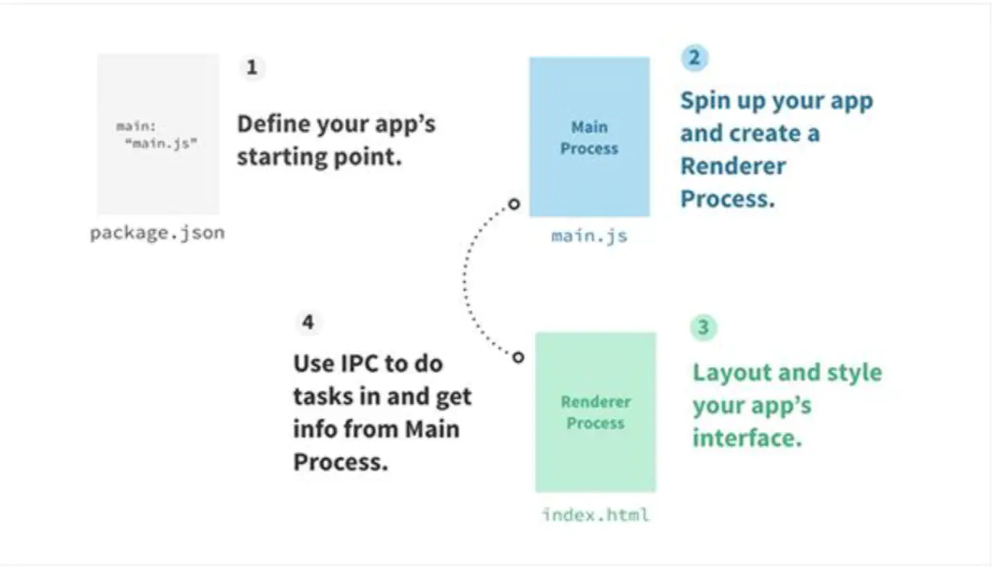
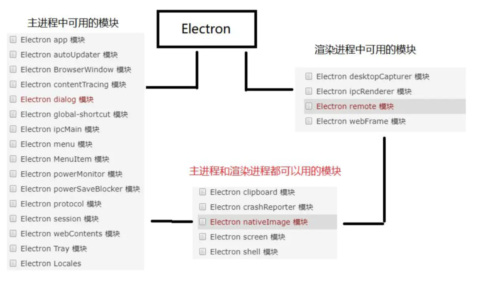

> 2020/7/29 by Hiya

# Electron

> Electron 是一个用 HTML，CSS 和 JavaScript 来构建跨平台桌面应用程序的一个开源库，有 GitHub 开发。

## 简单的示例

### 新建`electron`项目

目录结构

```
./
|_ index.html
|_ main.js
|_ package.json
```

### 安装 `electron`

```
# 全局安装
yarn global add electron

# or 项目开发依赖
yarn add electron -D
```

在`package.json`中添加脚本：

```json
{
  "scripts": {
    "start": "electron ."
  } 
}
```

### main.js

```js
const { app, BrowserWindow } = require('electron')

function createWindow () {   
  // 创建浏览器窗口
  const win = new BrowserWindow({
    width: 800,
    height: 600,
    webPreferences: {
      nodeIntegration: true
    }
  })

  // 并且为你的应用加载index.html
  win.loadFile('index.html')

  // 打开开发者工具
  win.webContents.openDevTools()
}

// Electron会在初始化完成并且准备好创建浏览器窗口时调用这个方法
// 部分 API 在 ready 事件触发后才能使用。
app.whenReady().then(createWindow)

//当所有窗口都被关闭后退出
app.on('window-all-closed', () => {
  // 在 macOS 上，除非用户用 Cmd + Q 确定地退出，
  // 否则绝大部分应用及其菜单栏会保持激活。
  if (process.platform !== 'darwin') {
    app.quit()
  }
})

app.on('activate', () => {
  // 在macOS上，当单击dock图标并且没有其他窗口打开时，
  // 通常在应用程序中重新创建一个窗口。
  if (BrowserWindow.getAllWindows().length === 0) {
    createWindow()
  }
})
```

### index.js

```html
<!DOCTYPE html>
<html>
  <head>
    <meta charset="UTF-8">
    <title>Hello World!</title>
    <!-- https://electronjs.org/docs/tutorial/security#csp-meta-tag -->
    <meta http-equiv="Content-Security-Policy" content="script-src 'self' 'unsafe-inline';" />
  </head>
  <body>
    <h1>Hello World!</h1>
    We are using node <script>document.write(process.versions.node)</script>,
    Chrome <script>document.write(process.versions.chrome)</script>,
    and Electron <script>document.write(process.versions.electron)</script>.
  </body>
</html>
```

### 运行项目

```
yarn start
```

## 运行流程



## 概念理解

### 主进程

> 主进程，通常是名为main.js 的文件，是每个 Electron 应用的入口文件。它控制着整个 App 的生命周期，从打开到关闭。 它也管理着系统原生元素比如菜单，菜单栏，Dock 栏，托盘等。 主进程负责创建 APP 的每个渲染进程。而且整个 Node API 都集成在里面。

### 渲染进程

> 渲染程序是应用程序中的一个浏览器窗口。与主进程不同，渲染程序可以有多个渲染程序，每个渲染程序都运行在一个单独的进程中。它们也可以被隐藏起来。

## Electron模块

在 electron 中有许多模块，但有些模块只允许主进程使用，有些是渲染进程使用，也存在两者都能使用的模块。



## 进程通信

在开发中，有时渲染进程需要获取主进程的一些信息或通知主进程去处理一些事件，这时就需要用到进程通信了。

Electron进程通信常用到的两个模块：`ipcMain` 和 `ipcRenderer`

- `ipcMain` - 当在主进程中使用时，它处理从渲染器进程(网页)发送出来的异步和同步信息,当然也有可能从主进程向渲染进程发送消息。
- `ipcRenderer` 使用它提供的一些方法从渲染进程 (web 页面) 发送同步或异步的消息到主进程。 也可以接收主进程回复的消息

示例：

```js
```

## 脚手架

[electron-react-boilerplate](./electron/electron-react-boilerplate/)

## 常见问题

1、安装依赖失败

安装 `electron` 的部分依赖时会失败，可以尝试通过设置npm或yarn的下载源，这里推荐使用淘宝镜像源。

```
# npm
npm config set registry https://registry.npm.taobao.org  
npm config set ELECTRON_MIRROR http://npm.taobao.org/mirrors/electron/

# or 
# yarn
yarn config set registry https://registry.npm.taobao.org  
yarn config set ELECTRON_MIRROR http://npm.taobao.org/mirrors/electron/
```