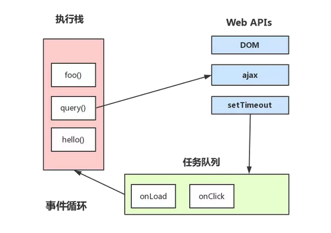
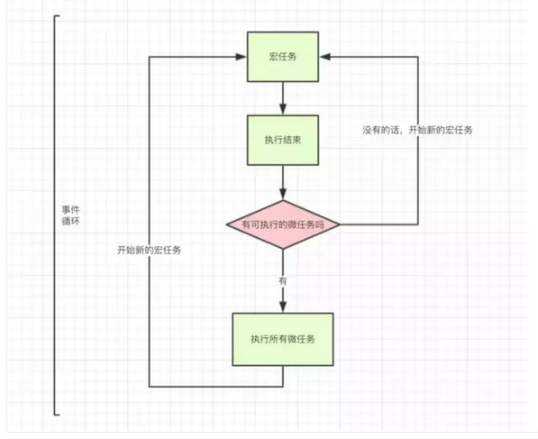

> 2020/6/20 by Hiya

# JS的执行过程

JS的执行过程分为三个阶段：

语法分析 > 预编译阶段 > 执行阶段

## 语法分析阶段：

分别对加载完成的代码块进行语法校验，语法正确则进入预编译阶段，否则停止对该代码的执行。

## 预编译阶段：

执行上下文类型：

- 全局环境 - JS进入预编译阶段即进入全局环境，全局环境有且仅有一个
- 函数环境 - 函数被调用时，进入该函数环境
- eval 环境 - 使用eval函数执行JS代码

### 什么是执行上下文？

JS在运行时，在不同的环境下会创建对应的执行上下文，JS在执行时会创建不小于1个的执行上下文，JS引擎会以栈的方式处理这些执行上下文，栈底永远是全局执行上下文，栈顶永远是当前执行上下文。

执行栈特点：先进后出，后进先出

```js
function foo() {
  console.log('foo')
}

function bar() {
  console.log('bar')
  foo()
}

bar()

// => 全局执行上下文
// => bar函数执行上下文 | 全局执行上下文
// => foo函数执行上下文 | bar函数执行上下文 | 全局执行上下文
```
### 创建执行上下文

创建执行上下文主要做了三件事：

 - 确定this指向
 - 创建变量对象
 - 创建作用域链

#### 确定this指向

在全局执行上下文中，浏览器的this指向window，node的this指向global。

函数执行上下文的this根据函数的调用方式，确定this指向。具体有：默认绑定、隐式绑定、显示绑定、new绑定、箭头函数等。

#### 创建变量对象

1. 创建arguments对象，检测当前上下文的参数，建立该对象的属性和属性值，仅针对函数环境（非箭头函数），全局环境无此过程
2. 检测当前执行上下文的函数声明，将函数声明提前
3. 检测当前执行上下文的变量声明，将变量声明提前（仅针对var变量）

所有函数声明和变量声明提升都是在创建变量对象过程中进行，同时，函数声明提升优先级高于变量声明提升。

创建变量对象的是预编译阶段进行，此时函数和变量不可访问（访问let和const变量会报错），因为还未赋值，值为undefined。只有进入执行阶段，函数和变量都被赋予值，才能访问。

#### 创建作用域链

作用域链由当前执行环境的变量对象（未进入执行阶段前）与上层环境的一系列活动对象组成，它保证了当前执行环境对符合访问权限的变量和函数的有序访问。

- 作用域链的第一项是当前作用域（当前执行上下文的变量对象和活动对象）
- 作用域链的最后一项是全局作用域（全局执行上下文的活动对象）
- 作用域链保证了变量和函数的有序查找，从当前作用域一直查找到全局作用域，找到则停止查找，否则抛出错误。

闭包

- 在函数内部定义新的函数
- 内部函数能访问外部函数的局部变量
- 内部函数执行时，创建新的函数执行上下文，外部函数即为闭包

## 执行阶段

### 了解JS线程

JS是单线程的，单JS的单线程并非指JS只有一个线程，JS有四个线程，分别是：

- JS引擎线程 - JS内核，负责解析执行JS脚本的主线程
- 事件触发线程 - 属于浏览器内核进程，不受JS引擎线程控制，主要负责事件的控制（如键盘、鼠标等事件），当事件被触发时，将对应的事件推到事件队列中等待执行
- 定时器触发线程 - 主要负责 setTimeout 和 setInterval，当定时器计时完毕，将定时器处理函数推到事件队列中等待执行
- HTTP异步请求线程 - 主要负责XMLHttpRequest请求转态变化后，将对应的处理函数推到事件队列中等待执行。

JS的单线程是指JS永远只有JS引擎线程在执行JS脚本程序，其他三个线程只是负责协助，不参与脚本的解析与运行。

### 理解宏任务和微任务

JS中的任务分为两种类型：

- 宏任务（macro-task），或叫task
- 微任务（micro-task），或叫jobs

#### 宏任务

宏任务可分为**同步任务**和**异步任务**

- 同步任务 - 指在JS引擎线程中按顺序执行的任务，只要当前一个任务执行完后，下一个任务才能执行。

- 异步任务 - 指不直接进入JS引擎线程，而是在满足条件时，相关线程会将该异步任务推进任务队列中，等待JS引擎线程上的所有任务执行完，在空闲时从任务队列中读取任务执行。

理解同步任务和异步任务的执行顺序，可以帮助理解事件循环（Event Loop）机制

事件循环

- 主线程任务执行
- 异步任务等待触发
- 任务队列



JS主线程执行过程：

- 首先执行宏任务中的同步任务，在主线程上生成一个执行栈
- 当主线程执行中遇到异步任务，则开启对应的线程进行监控
- 当异步任务满足触发条件时，对应的异步任务控制线程将异步任务推到任务队列中
- 主线程的任务都执行完毕后，读取任务队列中的事件，将任务队列中的事件推进主线程，按顺序执行
- 当主线程上的任务都执行完毕，再次读取任务队列中的事件，如此循环，形成事件循环

示例

```js
console.log('start script')

setTimeout(() => {
  console.log('setTimeout')
}, 0)

console.log('end script')
```

示例中，`console.log('start script')` 和 `console.log('end script')` 是同步任务，`setTimout` 是异步任务，JS主线程在执行时，从上到下执行，遇到`setTimeout`则交由定时器触发线程监控，继续执行下面的代码。最终结果：

```
start script
end script
setTimeout
```

#### 微任务

微任务主要有 `Promise` 和 `process.nextTick`。



宏任务和微任务的执行顺序：

1. 执行宏任务中的同步任务
2. 检测是否存在微任务，若存在，则执行所有微任务，然后在从任务队列中读取事件，推到主线上形成新的宏任务；否则直接从任务队列中读取事件，推到主线程上形成新的宏任务。
3. 开始执行新的宏任务，执行完毕后，再次执行步骤2

示例

```js
console.log('start script')

Promise.resolve().then(function() {
  console.log('promise1');
}).then(function() {
  console.log('promise2');
})

setTimeout(() => {
  console.log('setTimeout')
}, 0)

console.log('end script')
```

结果

```
start script
end script
promise1
promise2
setTimeout
```