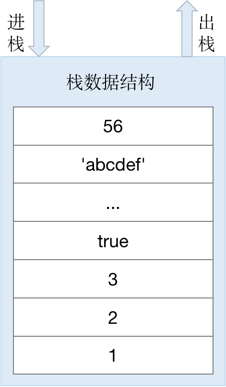
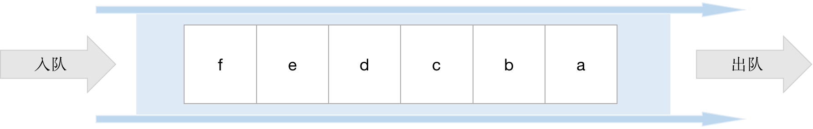

> 2020/6/23 by Hiya

# JS的内存机制

## 相关数据结构

### 栈数据结构

栈的结构是先进后出。

### 推数据结构

堆的结构是一种树状结构。

### 队列

队列的结构是先进先出。

## 变量的存放

在JS中共有9中数据类型: `String`, `Number`, `Boolean`, `Undefined`, `Symbol`, `BitInt`, `Null`, `Object`, `Function`。其中，基本数据类型有7中：`String`, `Number`, `Boolean`, `Undefined`, `Symbol`, `BitInt`, `Null`；引用类型有2中：`Object`, `Function`。

对于基本类型是保存在栈内存中，因为这些类型在内存中是有固定大小的空间的，可通过按值访问。

对于引用类型是保存在堆内存中，因为引用类型在内存中的大小是不固定的，不能保存在栈内存中，但它们的内存地址是固定的。因此引用类型会保存在堆内存中，而其内存地址会保存在栈内容中，通过访问内存地址即可访问到对应的引用类型数据。

## 内存空间管理

JS的内存生命周期是：

1. 分配所需的内存空间
2. 使用分配到的内容空间
3. 在不需要时将内存空间释放归还

JS的内存空间可分为：栈、堆和池（也是一种栈结构）。栈用于存放变量，堆存放复杂对象，池用于存放常量（所以也叫常量池）。

前面提到基本类型变量是保存在栈内存中，引用类型变量是保存在堆内存中。需要注意的是，闭包中的变量是保存在堆内存中。

## 内存回收

JS有自动垃圾回收机制，垃圾回收器会定时执行，找出不再使用的变量/对象，释放其占有的内存。

### 全局变量和局部变量的销毁

局部变量：执行完函数后，其函数内的局部变量便不再被使用，很容易被垃圾回收器识别回收。

全局变量：垃圾回收器很难知道变量什么时候不再被需要，因此应尽量减少全局变量的使用。

### 垃圾回收算法

常用的垃圾回收算法：

- 引用计数（现代浏览器不再使用）
- 标记清除（常用）

## 内存泄漏

对于持续运行的服务进程，必须及时释放不再使用的内存，否则内存占用会越来越高。对与不再使用的内存，没有及时清除，就叫做内存泄漏。

从内存来看 null 和 undefined 本质的区别是什么？

给一个全局变量赋值为null，相当于将这个变量的指针对象以及值清空，如果是给对象的属性 赋值为null，或者局部变量赋值为null,相当于给这个属性分配了一块空的内存，然后值为null， JS会回收全局变量为null的对象。

给一个全局变量赋值为undefined，相当于将这个对象的值清空，但是这个对象依旧存在,如果是给对象的属性赋值 为undefined，说明这个值为空值