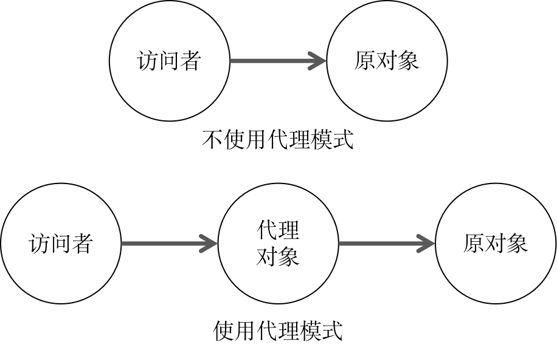

# Javascript 设计模式之代理模式

> 定义：为一个对象提供一个替代对象，以便控制对原对象的访问。

代理模式是一种非常有用的设计模式，在生活中也存在许多应用代理模式的场景，比如科学上网, 代购等。

使用代理模式的原因是当我们不方便直接访问一个对象时，提供一个代理对象来控制对原对象的访问，由代理对象对请求作出一些处理，再把请求转交给原对象。



## 示例

现在以购买一台苹果电脑为例，来对代理模式进行简单说明。

现有一顾客A，想要购买一台Mac笔记本，刚好附近有一家苹果官方店，所以就直接到该苹果店购买了一台Mac笔记本。在这个过程中，顾客A和苹果店直接发生联系，中间并没有出现代理对象，所以该例子不需要使用代理模式。代码如下：

```js
// 苹果商店
const Apple = {
  macPro: () => {
    console.log('购买 MacBook Pro')
  }
}

// 顾客A
const customerA = {
  buyMacPro: (target) => {
    target.macPro()
  }
}

// 顾客A购买苹果的Mac笔记本
customerA.buyMacPro( Apple ) // 购买 MacBook Pro
```

例子中的顾客A对象调用了 `buyMacPro` 方法，该方法接受Apple对象，并调用Apple对象的 `macPro` 方法。

现在A又想买一台Mac笔记本，但发现海外的苹果笔记本售价比大陆便宜，想从海外购买，但又不想出国，所以A找了专门做外海代购的代购员B，帮他从海外购买一台Mac笔记本。代码如下：

```js
// 苹果商店
const Apple = {
  macPro: () => {
    console.log('购买 MacBook Pro')
  }
}

// 顾客A
const customerA = {
  buyMacPro: (target) => {
    target.macPro()
  }
}

// 代购员B
const B = {
  macPro: () => {
    Apple.macPro()
  }
}

customerA.buyMacPro( B ) // 购买 MacBook Pro
```

例子中的顾客A对象调用了 `buyMacPro` 方法，该方法现在接受的是对象B，并且调用的是B对象的 `macPro` 方法，由B对象对Apple对象进行访问。

至此我们完成了一个最简单的代理模式的写法，但上述例子只是一个简单的示例，并没有体现出使用代理模式的好处。

现在增加一下场景需求，顾客A想买的Mac笔记本是最新款的，距离发售日期还有一段时间，A不想时时关注笔记本的发售情况，所以委托B，由B关注笔记本的发售时间，一旦发售，则帮A抢购。代码如下：

```js
// 苹果商店
const Apple = {
  macPro: () => {
    console.log('购买 MacBook Pro')
  },
  sale: (fn) => {
    setTimeout(() => {
      fn && fn()
    }, 2000)
  }
}

// 顾客A
const customerA = {
  buyMacPro: (target) => {
    target.macPro()
  }
}

// 代购员B
const B = {
  macPro: () => {
    Apple.sale( Apple.macPro )
  }
}

customerA.buyMacPro( B ) 
// 2s后出现 购买 MacBook Pro
```

本例中的 `customerA` 对象仅负责发起一个请求，即调用了 `buyMacPro` 方法购买 Mac笔记本，而真正的购买过程由对象B处理，该过程中对象B调用 Apple对象的 `sale` 方法监听Mac笔记本的发售情况，一旦发售，则调用 Apple对象的 `macPro` 购买Mack笔记本。

以上例子中，我们可以把 `customerA` 对象最为访问者对象，`Apple`对象作为原对象，B对象则是代理对象。访问者仅负责发起访问原对象的请求，并接受最终的请求处理结果，而对访问者发起的请求是全权由代理对象负责处理，由代理对象对原对象进行访问操作（该过程对访问者对象来说是透明的），并将访问操作的做过返回给访问者对象。

在很多情况下，对原对象的访问操作是不可预测的，对原对象的访问操作可能是无效的、非法的、不安全的，为了保证访问操作的有效安全性，通常我们都会设置一个代理对象，由代理对象负责与原对象进行联系，屏蔽外界对原对象的感知，由代理对象对所有的访问操作进行检测过滤，保证访问操作是正确有效可行的。

## 代理的类型

### 事件代理


