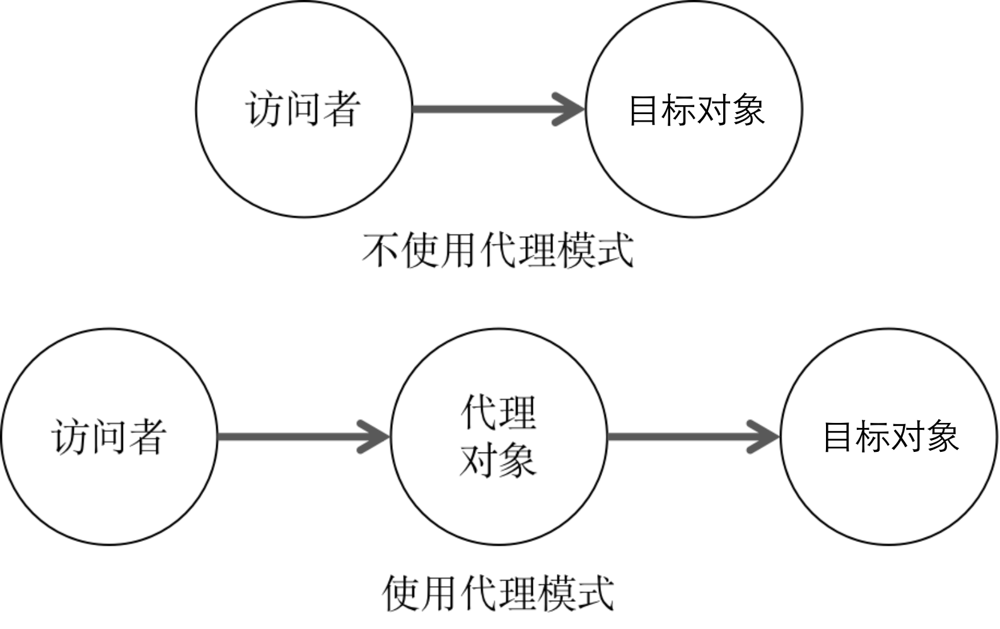

# Javascript 设计模式之代理模式

> 定义：为一个对象提供一个替代对象，以便控制对目标对象的访问。

代理模式是一种非常有用的设计模式，在生活中也存在许多应用代理模式的场景，比如科学上网, 代购等。

使用代理模式的原因是当我们不方便直接访问一个对象时，提供一个代理对象来控制对目标对象的访问，由代理对象对请求作出一些处理，再把请求转交给目标对象。



## 示例

现在以购买一台苹果电脑为例，来对代理模式进行简单说明。

现有一顾客A，想要购买一台Mac笔记本，刚好附近有一家苹果官方店，所以就直接到该苹果店购买了一台Mac笔记本。在这个过程中，顾客A和苹果店直接发生联系，中间并没有出现代理对象，所以该例子不需要使用代理模式。代码如下：

```js
// 苹果商店
const Apple = {
  macPro: () => {
    console.log('购买 MacBook Pro')
  }
}

// 顾客A
const customerA = {
  buyMacPro: (target) => {
    target.macPro()
  }
}

// 顾客A购买苹果的Mac笔记本
customerA.buyMacPro( Apple ) // 购买 MacBook Pro
```

例子中的顾客A对象调用了 `buyMacPro` 方法，该方法接受Apple对象，并调用Apple对象的 `macPro` 方法。

现在A又想买一台Mac笔记本，但发现海外的苹果笔记本售价比大陆便宜，想从海外购买，但又不想出国，所以A找了专门做外海代购的代购员B，帮他从海外购买一台Mac笔记本。代码如下：

```js
// 苹果商店
const Apple = {
  macPro: () => {
    console.log('购买 MacBook Pro')
  }
}

// 顾客A
const customerA = {
  buyMacPro: (target) => {
    target.macPro()
  }
}

// 代购员B
const B = {
  macPro: () => {
    Apple.macPro()
  }
}

customerA.buyMacPro( B ) // 购买 MacBook Pro
```

例子中的顾客A对象调用了 `buyMacPro` 方法，该方法现在接受的是对象B，并且调用的是B对象的 `macPro` 方法，由B对象对Apple对象进行访问。此时，这里的B对象充当的就是一个代理对象。

至此我们完成了一个最简单的代理模式的写法，但上述例子只是一个简单的示例，并没有体现出使用代理模式的好处。

现在增加一下需求，顾客A想买的Mac笔记本是最新款的，距离发售日期还有一段时间，A不想时时关注笔记本的发售情况，所以委托B，由B关注笔记本的发售时间，一旦发售，则帮A抢购。代码如下：

```js
// 苹果商店
const Apple = {
  macPro: () => {
    console.log('购买 MacBook Pro')
  },
  sale: (fn) => {
    setTimeout(() => {
      fn && fn()
    }, 2000)
  }
}

// 顾客A
const customerA = {
  buyMacPro: (target) => {
    target.macPro()
  }
}

// 代购员B
const B = {
  macPro: () => {
    Apple.sale( Apple.macPro )
  }
}

customerA.buyMacPro( B ) 
// 2s后出现 购买 MacBook Pro
```

本例中的 `customerA` 对象仅负责发起一个请求，即调用了 `buyMacPro` 方法购买 Mac笔记本，而真正的购买过程由对象B处理，该过程中对象B调用 Apple对象的 `sale` 方法监听Mac笔记本的发售情况，一旦发售，则调用 Apple对象的 `macPro` 购买Mack笔记本。

以上例子中， `customerA` 对象是一个访问者对象，`Apple`对象是目标对象，B对象则是代理对象。访问者仅负责发起访问目标对象的请求，并接受最终的请求处理结果，而对访问者发起的请求是全权由代理对象负责处理，由代理对象对目标对象进行访问操作（该过程对访问者对象来说是透明的），并将访问操作的最终结果返回给访问者对象。

使用的代理的好处是对访问者来说，代理对象和目标对象是一致的， 代理接手请求的过程对于访问者来说是透明的，访问者并不清楚代理对象和目标对象的区别，这样做有两个好处：
- 访问者可以放心地请求代理，他只关心是否能得到想要的结果。
- 在任何使用目标对象的地方都可以替换成使用代理。

使用代理模式的意义是可以更好的遵循SOLID原则中的单一职责原则，

## 常见代理的类型

### 事件代理

事件代理是代理模式最常见的一种代理类型，如下有这样一个例子：

```html
<ul id="list">
  <li>item one</li>
  <li>item two</li>
  <li>item three</li>
  <li>item four</li>
  <li>item five</li>
</ul>
```

例子中是一个 `ul` 列表，现在需求是点击每个 `li` 标签都会弹出一个提示框，内容是点击的`li`标签的内容，如：‘item one’。

正常的做法：

```js
const lis = document.querySelectorAll( '#list li' )
for ( let i = 0; i < lis.length; i++ ) {
  const curLi = lis[ i ]
  curLi.addEventListener( 'click', () => {
    alert( curLi.innerText )
  } )
}
```

以上代码是满足需求的，但存在一些问题：
- 列表过多时，需要为每个`li`标签监听点击事件，会带来一些开销
- 动态增加新的`li`标签时，需要手动为新增的`li`绑定点击事件

考虑到事件具有冒泡性，我们可以将点击事件绑定到`ul`上，由`ul`监听点击事件，而`li`就不用再绑定点击事件——这种做法就是事件代理。代码如下：
```js
const ul = document.getElementById( 'list' )
ul.addEventListener( 'click', ( e ) => {
  const target = e.target
  alert( target.innerText )
} )
```

通过事件代理，可以很好的解决上述的问题。

### 虚拟代理

常见的应用场景是图片预加载。使用图片预加载可以避免因网络不好或图片过大时，图片的位置很长时间显示一片空白的问题。常见的做法是先用一张
loading 图片占位，然后用异步的方式加载图片，等图片加载好了再把它填充到 img 节点里，这种场景就很适合使用虚拟代理。

示例如下：

```html
<!DOCTYPE html>
<html lang="en">

<head>
  <meta charset="UTF-8">
  <meta name="viewport" content="width=device-width, initial-scale=1.0">
  <title>虚拟代理</title>
  <style>
    img {
      display: inline-block;
      min-width: 200px;
      height: 200px;
    }

    img.loading {
      background-color: #ddd;
    }
  </style>
</head>

<body>
  <div id="app">
    
  </div>
  <script>
    const image = document.getElementById( 'image' )

    const loadImage = {
      setSrc: ( imageNode, imageSrc ) => {
        imageNode.src = imageSrc
      }
    }

    const proxyImage = {
      setSrc: ( imageNode, imageSrc ) => {
        if ( !imageNode || !imageSrc ) return
        imageNode.classList.add( 'loading' )

        const virtualImage = new Image()
        virtualImage.onload = () => {
          imageNode.classList.remove( 'loading' )
          loadImage.setSrc( imageNode, imageSrc )
        }
        virtualImage.src = imageSrc
      }
    }

    const imageSrc = '../assets/proxy.png'
    proxyImage.setSrc( image, imageSrc )
  </script>
</body>

</html>
```

在示例中，`virtualImage`对象代替了真实的`DOM`发起真正的图片加载请求、完成图片加载工作，但从未出现在渲染层面上，因此这种模式叫做虚拟代理。

### 缓存代理

缓存代理一般应用于一些计算量较大的场景里，在这种场景下，我们可以用“空间换时间”——对于已经计算过的值，我们不想在每次使用时都去计算它，而是希望从内存中直接读取出已经计算过的值，我们可以使用代理，在每次计算时，同时把结果缓存下来。

以计算斐波那契数列为例，不使用缓存时：

```js
function fibonacci(num) {
  if(num === 1 || num === 2) return 1
  return fibonacci( num - 1 ) + fibonacci( num - 2 )
}

console.time('fibonacci')
console.log( '20: ', fibonacci(20)) // 20:  6765
console.timeEnd('fibonacci')
// 平均耗时7ms左右
```

使用缓存时：

```js
const fibonacci = (function () {
  const cache = {}
  return (num) => {
    if(num === 1 || num === 2) return 1
    if ( !cache[ num ]) {
      const result = fibonacci( num - 1 ) + fibonacci( num - 2 )
      cache[num] = result
    }
    return cache[num]
  }
})()

console.time( 'fibonacci' )
console.log( '20: ', fibonacci( 20 ) ) // 20:  6765
console.timeEnd( 'fibonacci' )
// 平均耗时5ms左右
```

对比不使用缓存时，使用缓存后，计算斐波那契数列的耗时相对更短一些。

### 保护代理

一般来说，如果让访问者直接访问目标对象，可能会带来一些意想不到的情况，因为对目标对象来说，访问者的访问请求是不可预测，为了避免访问者对目标对象做出一些非法的操作，我们可以在访问中和目标对象中间增加代理对象，用来拦截过滤访问者的请求，仅对合法的请求作出响应。

使用保护代理模式时，我们可以优先考虑使用ES6的`Proxy`。`Proxy`可以在目标对象上设置一层拦截，任何想要访问目标对象的地方，都必须先通过这层拦截。利用`Proxy`，我们可以对外界的访问进行过滤或改写，避免一些非法的访问造成不可预测的错误。

Proxy 支持的拦截操作共有一共 13 种，这里主要介绍下 `get` 和 `set`

- `get(target, propKey, receiver)` - 拦截对象属性的读取
- `set(target, propKey, value, receiver)` - 拦截对象属性的设置

#### get 方法

`get` 方法用于拦截对象的读取，接受的三个参数，分别是目标对象、属性名和 proxy 实例本身。

一个简单的例子

```js
const target = {
  name: 'Jack',
}

const targetProxy = new Proxy(target, {
  get: function (target, propKey) {
    if(target.hasOwnProperty(propKey)) {
      return target[propKey]
    } else {
      return false
    }
  }
})

console.log(targetProxy.name) // Jack
console.log(targetProxy.age) // false
```

使用 `get` 方法，实现数组元素的读取，满足以下要求：

- 使用非数值索引读取元素时，抛出错误
- 索引值大于数组长度时，再次从数组元素第一位开始读取
- 索引值小于0时，以逆序方式读取

代码如下：

```js
const target = [1,2,3,4,5,6]

const targetProxy = new Proxy(target, {
  get: (target, index) => {
    index = Number(index)
    if (isNaN(index)) {
      throw '无效的数组索引'
    }
    const length = target.length
    if(index < 0) {
      return target[length + index%length]
    } else if ( index > length ) {
      return target[ index % length ]
    }
    return target[index]
  }
})
```

#### set 方法

`set` 方法用来拦截某个属性的赋值操作，可以接受四个参数，依次为目标对象、属性名、属性值和 Proxy 实例本身

一个简单的例子

```js
const target = {
  name: 'Jack',
}

const targetProxy = new Proxy(target, {
  set: (target, propKey, propValue) => {
    if(propKey === 'age') {
      if(typeof propValue !== 'number') {
        throw 'The age is not an intege'
      }
      if(propValue < 0 || propValue > 100) {
        throw 'The age is invalid'
      }
    }
    target[propKey] = propValue
  }
})

targetProxy.age = 25
console.log(targetProxy.age) // 25
targetProxy.age = 300 // 报错
```

使用 `set` 实现只能存放number类型的数组

```js
const target = []

const targetProxy = new Proxy(target, {
  set: (target, key, value) => {
    const index = Number( key )
    if ( !isNaN( index ) && typeof value === 'number') {
      target[key] = value
    }
    return value === false ? -1 : value
  }
})
```

相关知识请参考：https://es6.ruanyifeng.com/#docs/proxy

## 小结

代理模式的使用场景是多样化的，既可以是为了加强控制、拓展功能、提高性能，也可以仅仅是为了优化我们的代码结构、实现功能的解耦。但无论是出于什么目的，使用代理模式的套路是——当一个对象A不方便直接访问另一个对象B时，需要借助一个对象C，由C访问B，这里C就是代理器。需要一个代理器解决问题时，就是对代理模式的应用。


