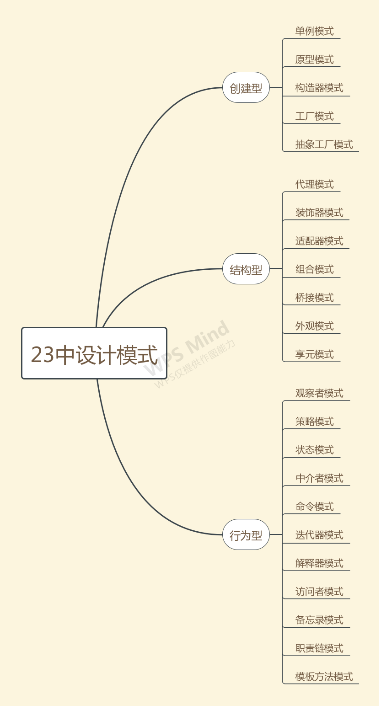

# Javascript 设计模式

> 设计模式的定义：在面向对象软件设计过程中针对特定问题的简洁而优雅的解决方案

## 为什么使用设计模式？

> 每一个模式描述了一个在我们周围不断重复发生的问题，以及该问题的解决方案的核心。这样，你就能一次又一次地使用该方案而不必做重复劳动。 —— Christopher Alexander

设计模式并非是一套晦涩难懂的理论，而是一套帮助软件开发人员解决不同问题方案的集合。使用设计模式，可以帮助我们更好地解决软件开发过程中遇到的问题，也能使我们的代码设计更符合SOLID设计原则，使代码更加具备健壮性，可扩张性和可读性。

## SOLID设计原则

> "SOLID" 是由罗伯特·C·马丁在 21 世纪早期引入的记忆术首字母缩略字，指代了面向对象编程和面向对象设计的五个基本原则。

设计原则是设计模式的指导理论，可以帮助我们规避不好的软件设计。SOLID原则指的是以下五个原则：

- S - 单一职责原则（Single Responsibility Principle）
- O - 开放闭合原则（Opened Closed Principle）
- L - 里式替换原则（Liskov Substitution Principle）
- I - 接口隔离原则（Interface Segregation Principle）
- D - 依赖反转原则（Dependency Inversion Principle）

实际在JavaScript设计模式中，我们主要关注**“单一职责”**和**“开放闭合”**这两个原则即可。

### 单一职责原则

单一职责原则指的是，就一个对象（方法）而言，应该仅有一个引起它变化的原因。

如果一个对象承担过多职责，则意味着该对象将会复杂多变，那么在需求变化的过程中，该对象被改写的可能行就更大；同时过多的职责耦合在一起，可能会造成意想不到的影响，这种耦合性带来的是低内聚和脆弱的设计。

单一职责原则的体现是：一个对象（方法）只做一件事情。

### 开放闭合原则

> 当应用的需求改变时，在不修改软件实体的源代码的前提下，可以扩展模块的功能，使其满足新的需求。

开放闭合原则是软件设计的终极目标，它能使软件实体拥有一定的适应性和灵活性的同时具备稳定性和延续性。

## 设计模式的核心思想——封装变化

在软件开放的过程中，需求是不断变更的，这是导致软件设计越来越复杂的主要原因之一。

在实际开发过程，一成不变的代码是不存在，为了保证在需求不断变化的过程中，将变化造成的影响最小化，我们需要将变与不变分离，使不变稳定，可变灵活。这个过程叫做“封装变化”，这样的代码是健壮的，它经得起变化的考验。设计模式的意义就是帮助我们写出这样的代码。

## 设计模式

 [GOF](https://baike.baidu.com/item/GoF) 提出的最经典的23种设计模式:

 

在前端开发中，并非所有设计模式都会用到。以下文档是比较常用的一些设计模式在前端中的实践：

- [单例模式](./javascript/design/single/)
- [代理模式](./javascript/design/proxy/)
- [观察者模式](./javascript/design/observer/)
- [装饰器模式](./javascript/design/decorator/)

参考：
- [JavaScript 设计模式核⼼原理与应⽤实践](https://juejin.im/book/5c70fc83518825428d7f9dfb)
- [Java设计模式：23种设计模式](http://c.biancheng.net/design_pattern/)