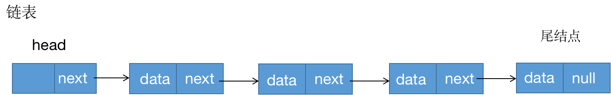
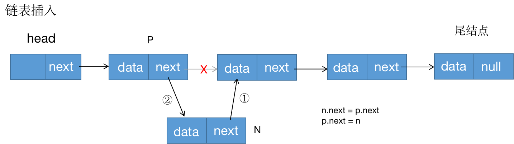
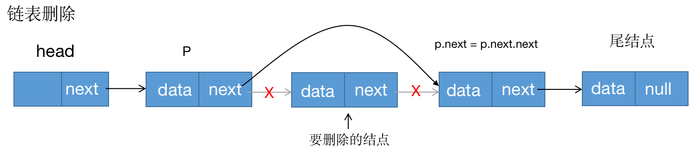
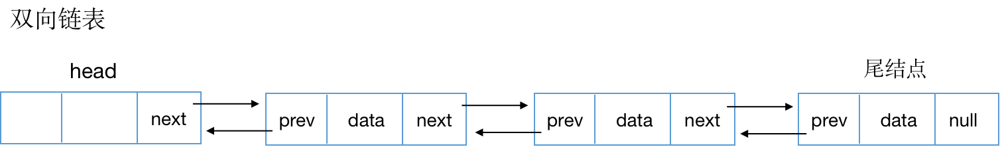
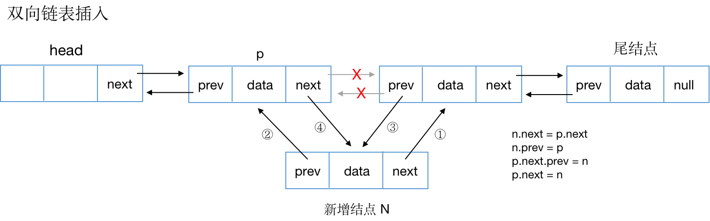
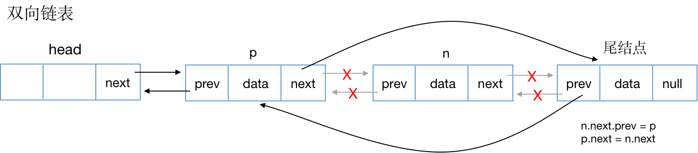

# 链表

链表同数组一样，也是一种线性存储结构，但与数组的区别是，链表在内存中的存储是非连续的。链表是一种适合进行增删操作的存储结构。

数组和链表随机查找和增删操作的时间复杂度比较：

| 时间复杂度 | 随机查找 | 增删 |
| ---------- | -------- | ---- |
| 数组       | O(1)     | O(n) |
| 链表       | O(n)     | O(1) |

## 链表类型

- 单向链表
- 双向链表
- 循环链表
- 双向循环链表

### 单向链表

数据结构

```js
class LinkNode {
  constructor(data) {
    this.data = data
    this.next = null
  }
}
```




代码

```js
class LinkList {
  head // 链表头结点
  constructor() {
    this.head = new LinkNode()
  }
}
```

#### 插入结点



代码

```js
class LinkList {
  /**
   * 在结点data后插入新的结点newData
   * @param {*} data 
   * @param {*} newData 
   */
  insert ( data, newData ) {
    let curNode = this.head.next
    while(curNode && curNode.data !== data) {
      curNode = curNode.next
    }
    if ( curNode === null ) return
    const newNode = new LinkNode( newData )
    newNode.next = curNode.next
    curNode.next = newNode
  }
}
```

核心代码

```js
newNode.next = p.next
p.next = newNode
```

#### 删除结点



代码

```js
class LinkList {
	/**
   * 移除值为data的结点
   * @param {*} data
   */
  remove (data) {
    let curNode = this.head.next
    let prev = this.head
    while (curNode && curNode.data !== data) {
      prev = curNode
      curNode = prev
    }
    if(curNode === null) return
    prev.next = prev.next.next
  }
}
```

核心代码

```js
prev.next = prev.next.next
```

### 单向循环链表

单向循环链表的数据同单向链表一样，只是链表的尾节点的next指向链表首节点。

### 双向链表

```js
class LinkNode {
  constructor(elem) {
    this.elem = elem
    this.next = null
    this.prev = null
  }
}
```



代码

```js
class LinkList {
  head // 链表头结点
  constructor() {
    this.head = new LinkNode()
    this.head.prev = null
    this.head.next = null
  }
}
```

#### 插入结点



核心代码

```js
newNode.next = curNode.next
newNode.prev = curNode
curNode.next.prev = newNode
curNode.next = newNode
```

#### 删除结点



核心代码

```js
curNode.next.prev = prevNode
prevNode.next = curNode.next
```

### 单向循环链表

单向循环链表的数据同单向链表一样，只是链表的尾节点的next指向链表首节点。


相关链接

- [链表代码](https://github.com/LiLiangKai/treasure/tree/master/javascript/leetcode/link/link)

