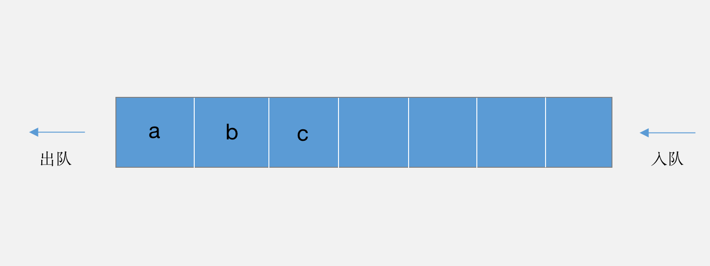
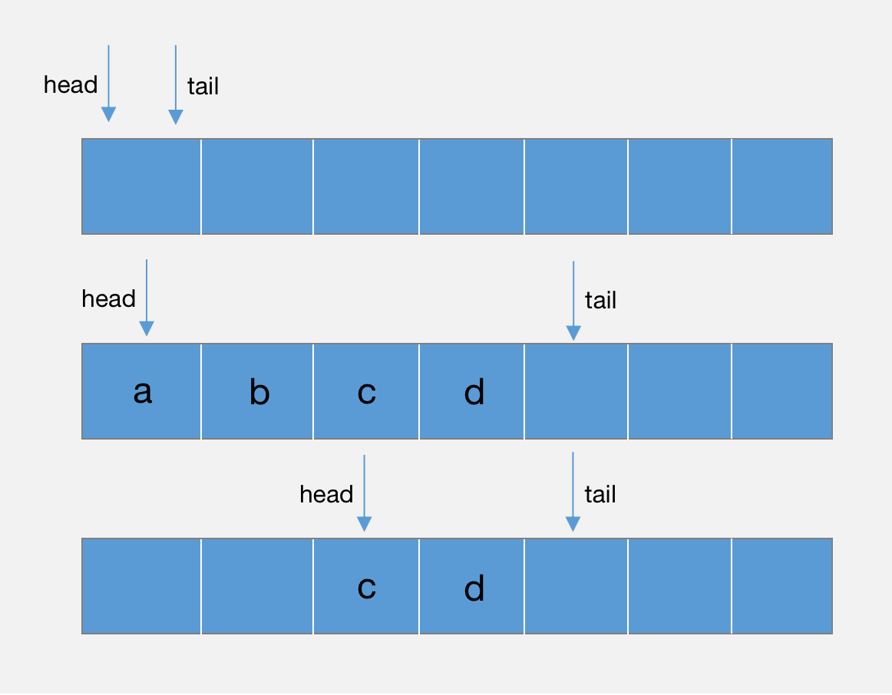
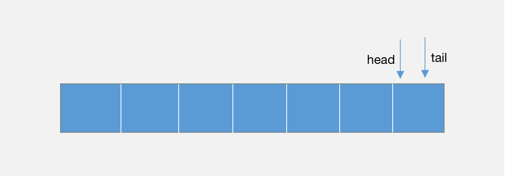
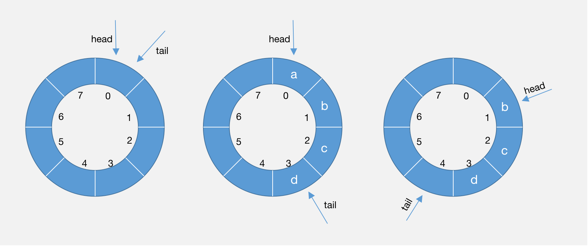
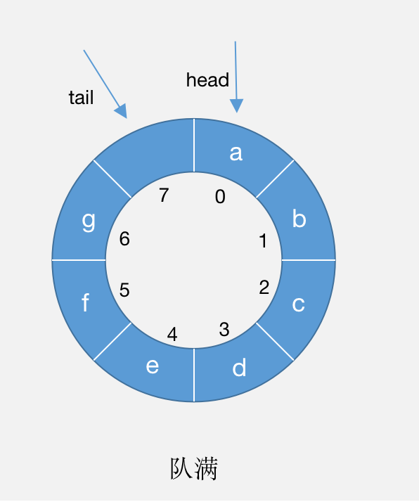

> 2020/9/16 by Hiya

# 队列

队列是一种数据先进先出的存储结构。在操作上，队列是一种操作受限的线性表结构，只有入队和出队两种操作。

在日常生活中，排队买票便是一种典型的队列，最先排队的人先买到票离开，最后来的人只能排在最后面。



队列的类型

以数组实现的队列叫顺序队列，以链表实现的队列叫链式队列。

## 顺序队列

实现顺序队列，需要一个存储队列元素的数组，还需要记录队列的头(head)和尾(tail)以及队列长度(length)。入队时，需要判断队列是否队满，出队时需要判断队列是否队空。

队满判断条件：`tail === length`

队空判断条件：`head === tail`



代码：

```js
class ArrayQueue {
  queue
  head
  tail
  length

  constructor (length) {
    if(typeof length !== 'number' || length <= 0) {
      throw '初始化队列失败，必须指定队列的长度，长度必须是有效的数值'
    }
    this.queue = new Array(length)
    this.head = 0
    this.tail = 0
    this.length = length
  }

  /** 出队 */
  dequeue () {
    // 出队要判断是否队空
    if(this.tail === this.head) return null
    const elem = this.queue[this.head]
    this.queue[ this.head ] = null
    this.head ++
    return elem
  }

  /** 入队 */
  enqueue (elem) {
    // 入队要判断是否队满
    if(this.tail === this.length) return false
    this.queue[this.tail] = elem
    this.tail++
    return true
  } 
}
```

以上代码存在一个问题，队列出队后，没有重置 `head` 和 `tail` 会导致后续入队操作失败。



解决方法，在每次出队后，对队列元素进行前移操作；或者在每次入队时，检测`head`是否为0，不为0时则进行前移再入队。

此处采用第二种方法，代码如下：

```js
class ArrayQueue {
  /** 入队 */
  enqueue (elem) {
    // 入队要判断是否队满
    if(this.tail === this.length && this.head === 0) return false
    if(this.head > 0) {
      // head指针不为0，将队列元素前移
      const queue = this.queue
      let n = 0
      for(let i=this.head; i<this.tail; i++) {
        queue[n] = this.queue[i]
        this.queue[i] = null
        n++
      }
      this.queue = queue
      this.head = 0
      this.tail = n
    }
    this.queue[this.tail] = elem
    this.tail++
    return true
  } 
}
```

## 链式队列

链式队列即用链表实现的队列，除了在存储结构上的不同，链式队列不需要关心队列元素是否需要前移。判断队满和队空的条件也有所不同，链式队列需要记录链表的结点数，当结点数等于队列长度时即队满，结点数为0时即队空。

代码：

```js
class LinkNode {
  constructor (elem) {
    this.elem = elem
    this.next = null
  }
} 

class LinkQueue {
  head
  tail
  length
  count

  constructor ( length ) {
    if ( typeof length !== 'number' || length <= 0 ) {
      throw '初始化队列失败，必须指定队列的长度，长度必须是有效的数值'
    }
    this.head = new LinkNode('head')
    this.tail = this.head
    this.length = length
    this.count = 0
  }

  /** 出队 */
  dequeue () {
    // 出队要判断是否队空
    if ( this.count === 0 ) return null
    const deNode = this.head.next
    this.head.next = deNode.next
    this.count --
    return deNode.elem
  }

  /** 入队 */
  enqueue ( elem ) {
    // 入队要判断是否队满
    if ( this.count === this.length ) return false
    const node = new LinkNode(elem)
    node.next = this.tail.next
    this.tail.next = node
    this.tail = node
    this.count ++
    return true
  }
}
```

## 循环队列

前面讲到，顺序队列在每次出队后，头指针会向后移，需要手动将队列元素向前移动，为解决这一问题，便出现了循环队列，循环队列也是一种顺序队列，但与普通的顺序队列不同，循环队列是头尾相接的顺序队列，如图：



循环队列队空的条件是 `head === tail`


队满的条件则不能根据 `tail === length && head === 0` 进行判断了。在循环队列中，索引0位置将不再是队列对头位置，对头位置永远是`head`指向的位置。



判断条件：`(tail+1)%length === head`

使用 `%length` 的原因是为了处理临界状态，即tail向后移动一个位置tail+1后，很有可能超出了数组的下标，这时它的下一个位置其实是0

代码：

```js
class ArrayQueue {
  queue
  head
  tail
  length

  constructor ( length ) {
    if ( typeof length !== 'number' || length <= 0 ) {
      throw '初始化队列失败，必须指定队列的长度，长度必须是有效的数值'
    }
    this.queue = new Array( length )
    this.head = 0
    this.tail = 0
    this.length = length
  }

  /** 判断队空 */
  isEmpty () {
    if ( this.tail === this.head ) return true
    return false
  }

  /** 判断队满 */
  isFull () {
    if ( (this.tail + 1) % this.length === this.head ) return true
    return false
  }

  /** 出队 */
  dequeue () {
    if ( this.isEmpty() ) return null
    const elem = this.queue[this.head]
    this.queue[ this.head ] = null
    this.head = ( this.head + 1 ) % this.length
    return elem
  }

  /** 入队 */
  enqueue ( elem ) {
    // 入队要判断是否队满
    if ( this.isFull() ) return false
    this.queue[this.tail] = elem
    this.tail = (this.tail + 1) % this.length
    return true
  }
}
```

需要注意的是，在循环队列中，即便是队满，队列中的元素个数也要比队列的长度少1。

[完整代码](https://github.com/LiLiangKai/treasure/tree/master/javascript/leetcode/queue/src)