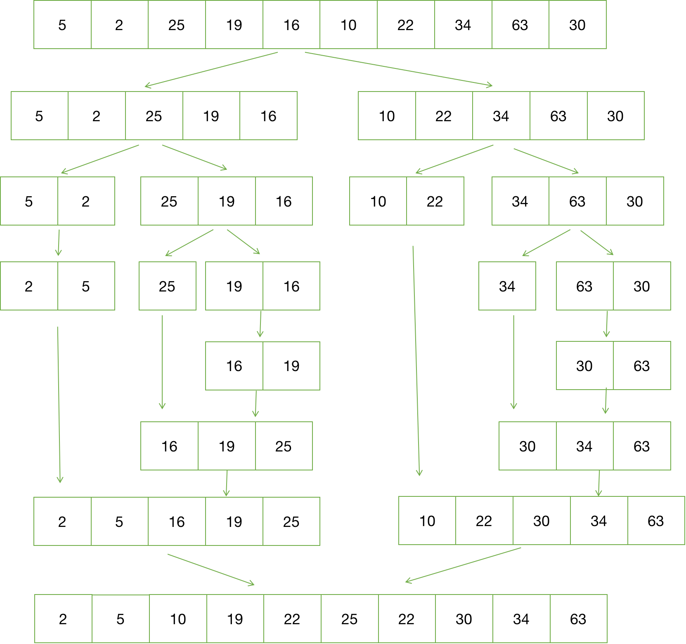

> 2020/7/15 by Hiya

# 排序

> 排序是指以一定的顺序（递增、递减等）对一个数组（或列表）中的项进行重新排序。

排序问题有许多不同的算法解决方案，而且也体现了许多计算机科学的想法：

- 比较与非比较策略，
- 迭代与递归实现，
- 分而治之范式（这个或这个），
- 最佳/最差/平均情况时间复杂性分析，
- 随机算法等

## 常见排序算法

1、基于比较的排序算法:

- 冒泡排序
- 选择排序
- 插入排序
- 归并排序 (递归实现)
- 快速排序 (递归实现)
- 随机快速排序 (递归实现)

2、不基于比较的排序算法:

- 计数排序
- 基数排序

## 冒泡排序

给定一个N个元素的数组，冒泡法排序将：

```
1、如果元素大小关系不正确，交换这两个数
2、比较一对相邻元素（a，b）
3、重复步骤1和2，直到我们到达数组的末尾（最后一对是第（N-2）和（N-1）项，因为我们的数组从零开始）
4、到目前为止，最大的元素将在最后的位置。 然后我们将N减少1，并重复步骤1，直到N = 1
```


代码实现

```js
function bubbleSort ( array ) {
  const length = array.length
  for ( let i = 0; i < length - 1; i++ ) {
    for ( let j = 0; j < length - 1 - i; j++ ) {
      if(array[j] > array[j+1]) {
        let t = array[ j + 1 ]
        array[ j + 1 ] = array[ j ]
        array[ j ] = t
      }
    }
  }
  return array
}
```

分析

比较和交换需要一个以常量为界的时间，我们称之为c。标准冒泡排序中有两个嵌套循环。外循环正好运行N次迭代。 但内部循环运行变得越来越短：

当 i = 0，（N-1）次迭代（比较和可能交换）时。
当 i = 1，（N-2）次迭代时，...
当 i =（N-2）时，1次迭代,
当 i=（N-1），0迭代.
因此，总迭代次数=（N-1）+（N-2）+ ... + 1 + 0 = N *（N-1）/ 2（推导）。
总时间= c * N *（N-1）/ 2 = O（N ^ 2）。

## 选择排序

给定 N 个项目和 L = 0 的数组，选择排序将：

- 在 [L ... N-1] 范围内找出最小项目 X 的位置，
- 用第 L 项交换X，
- 将下限 L 增加1并重复步骤1直到 L = N-2。


代码实现

```js
function selectionSort (array) {
  for(let i=0; i<array.length-1; i++) {
    let n = i
    for(let j=i+1; j<array.length; j++) {
      if(array[j] < array[n]) {
        n = j
      }
    }
    const t = array[n]
    array[n] = array[i]
    array[i] = t
  }
  return array
}
```

时间复杂度： O(n²) 

## 插入排序

算法步骤：

1、将第一待排序序列第一个元素看做一个有序序列，把第二个元素到最后一个元素当成是未排序序列。

2、从头到尾依次扫描未排序序列，将扫描到的每个元素插入有序序列的适当位置。（如果待插入的元素与有序序列中的某个元素相等，则将待插入元素插入到相等元素的后面。）


代码实现：

```js
function insertionSort (array) {
  for(let i=1; i<array.length; i++) {
    const current = array[i]
    let prevIdx = i - 1
    while(prevIdx >= 0 && array[prevIdx] > current) {
      array[prevIdx+1] = array[prevIdx]
      prevIdx--
    }
    array[prevIdx+1] = current
  }
  return array
}
```

分析：

外循环执行N-1次，但内循环执行的次数取决于输入：

- 在最好的情况下，数组已经排序并且（a [j]> X）总是为假所以不需要移位数据，并且内部循环运行在O（1），
- 在最坏的情况下，数组被反向排序并且（a [j]> X）始终为真插入始终发生在数组的前端，并且内部循环以O（N）运行。

因此，最佳情况时间是O(N × 1) = O(N) ，最坏情况时间是O(N × N) = O(N^2).

## 归并排序

归并排序采用分治的思想，即将大问题分解为小问题，小问题解决了，大问题自然也解决了。

递归步骤：

1. 将待排序数据分解为两个规模更小的数组（通常以数组长度一半进行分割）
2. 两个规模更小的数组是否可以继续分割，如果可以，对两个数组分别重复步骤1~2
3. 逐个遍历两个数组元素，按照要排序的顺序将数组元素依次合并

图解



递推公式

`mergeSort(array[i, l]) = merge(mergeSort(array[i, m]), mergeSort(array[m+1, l]))`

其中，`i`为数组第一个元素下标，`l`为数组最后一个元素下标，`m`为数组中间元素的下标(通常是 length/2)


代码：

```js
function mergeSort (array = []) {
  const length = array.length
  if(length < 2) return array
  // 分
  const mid = Math.floor(length / 2)
  const left = array.slice(0, mid)
  const right = array.slice(mid)
  // 并
  return merge(mergeSort(left), mergeSort(right))
} 

/** 合并数组 */
function merge (left = [], right = []) {
  const tmp = []

  while(left.length && right.length) {
    if(left[0] <= right[0]) {
      tmp.push(left.shift())
    } else {
      tmp.push(right.shift())
    }
  }

  while(left.length) {
    tmp.push(left.shift())
  }
  while(right.length) {
    tmp.push(right.shift())
  }

  return tmp
}
```

