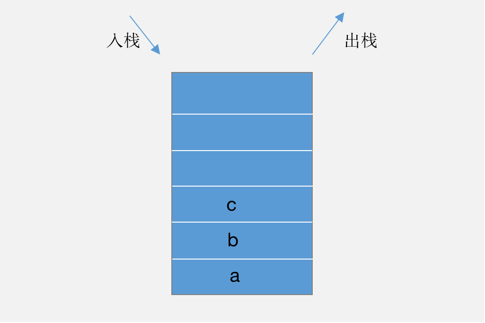

> 2020/9/12 by Hiya

# 栈

栈是一种数据先进后出的存储结构。在操作上，栈是一种操作受限的线性表结构，只有入栈和出栈两种操作。

在我们生活中，叠盘子就是类似栈的一种表现，最先放的碟子会放到最底下，最后放的碟子在最上面，使用时也是从最上面开始拿。



栈的类型

以数组方式实现的栈叫顺序栈，以链表方式实现的栈叫链式栈。

## 顺序栈

要实现顺序栈，我们需要定义一个数据，用于存储栈元素，还需要记录栈的长度和栈中元素的个数。

```js
class ArrayStack {
  stack
  length
  count

  /**
   * 顺序栈构造函数
   * @param {number} length 栈的长度
   */
  constructor (length) {
    if(typeof length !== 'number' || length <= 0) {
      throw `初始化栈失败，必须指定栈的长度，长度必须是有效的数值`
    }
    this.stack = new Array(length)
    this.length = length
    this.count = 0
  }
}
```

栈只有入栈(push)和出栈(pop)操作，所以在 `ArrayStack` 中定义两个方法 `push` 和 `pop` 

```js
class ArrayStack {
  /** 元素入栈 */
  push (elem) {
    // 入栈需要判断是否栈满
    if(this.count === this.length) return false
    this.stack[this.count] = elem
    this.count ++
    return true
  }

  /** 元素出栈 */
  pop () {
    // 出栈需要判断是否栈空
    if(this.count === 0) return null
    const elem = this.stack[this.count]
    this.count --
    this.stack[this.count] = undefined
    return elem
  }
}
```

入栈和出栈操作需要注意的是，入栈需要判断是否栈满，判断条件是栈元素个数等于栈的长度；出栈需要判断是否栈空，判断条件是栈元素为`0`。

## 链式栈

链式栈和顺序栈的实现方式是相同的，只是存储栈元素的方式不一样。

```js
/** 链表结点 */
class LinkNode {
  constructor (elem) {
    this.elem = elem
    this.next =null
  }
} 

class LinkStack {
  stack
  length
  count

  /**
   * 链式栈构造函数
   * @param {number} length 栈的长度
   */
  constructor ( length ) {
    if ( typeof length !== 'number' || length <= 0 ) {
      throw `初始化栈失败，必须指定栈的长度，长度必须是有效的数值`
    }
    this.stack = new LinkNode('head')
    this.length = length
    this.count = 0
  }

  /** 元素入栈 */
  push ( elem ) {
    if(this.count === this.length) return false
    const newNode = new LinkNode(elem)
    // 使用头插法插入节点
    newNode.next = this.stack.next
    this.stack.next = newNode
    this.count ++
  }

  /** 元素出栈 */
  pop () {
    if(this.count === 0) return false
    const topNode = this.stack.next
    this.stack.next = topNode.next
    topNode.next = null
    this.count --
    return topNode.elem
  }
}
```

使用链式栈时，对元素的入栈，可以使用头插法，即在每次入栈的元素都插在首节点位置，出栈时也是取出首节点即可，避免了遍历链表操作。

- [完整代码](https://github.com/LiLiangKai/treasure/tree/master/javascript/leetcode/stack/src)