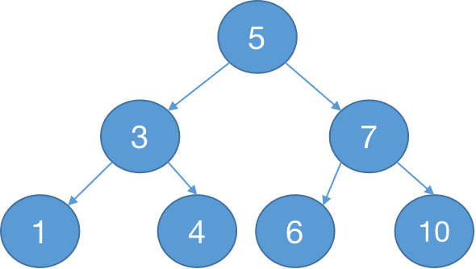

> 2021/4/6 by Hiya

# BST 二叉搜索树

二叉搜索树是相较于顺序查找数组或链表的一种查找效率更为高效的数据结构。


<p style="text-align:center;color:#999;font-size:12px">图1</p>

定义二叉搜索树的结点数据结构

```js
function TreeNode (key, value, p = null) {
  this.key = key
  this.value = value
  this.p = p
  this.left = this.right = null
}
```

说明：
- `key` - 结点唯一标识，也用于结点之间大小的对比判断
- `value` - 结点保存的数据
- `p` - 结点的父结点，根节点的父结点为`null`，即 `node.p=null`
- `left` - 结点的左孩子
- `right` - 结点的右孩子

定义二叉搜索树类

```js
class BST {
  constructor () {
    this.root = null  
  }
}
```

说明：
- `root` - 二叉搜索树的根结点

## 搜索节点

在`BST`类中新增方法`search`

```js
class BST {

  search (key) {
    let node = this.root
    while(node) {
      if(node.key === key) {
        return node
      } else if(node.key > key) {
        node = node.left
      } else {
        node = node.right
      }
    }
    return node
  }
}
```

以上代码为循环迭代实现，从根结点开始向下查找，如果当前结点的key等于要查找的key值，表示结点已查找到，直接返回结点；否则根据key值得对比情况，决定是往左子树查找还是右子树查找，当前结点key值小于要查找的key，继续查找右子树，否则查找左子树。

递归实现：

```js
function search (node, key) {
  if(!node) return node
  if(node.key === key) return node
  if(node.key < key) {
    return search(node.right, key)
  } else {
    return search(node.left, key)
  }
}

class BST {
  search (key) {
    return search(this.root, key)
  }
}
```

根据于图1:
- 查找key为5的结点，查找路径为：`5`
- 查找key为4的结点，查找路径为：`5 --> 3 --> 4`
- 查找key为9的结点，查找路径为：`5 --> 7 --> 10 --> null`

## 最小最大节点

根据二叉搜索树的性质，一颗二叉搜索树的最小节点一定在根结点的左子树中，最大节点一定在根结点的右子树中。

代码如下：

```js
class BST {
  min (node) {
    node = node || this.root
    while(node && node.left) {
      node = node.left
    }
    return node
  }

  max (node) {
    node = node || this.root 
    while(node && node.right) {
      node = node.right
    }
    return node
  }
}
```

查找最小节点，只要向左子树中查找即可，即结点存在左子树，则继续往左子树中查找，直到左子树不存在；查找最大结点的操作与查找最小结点操作相反，只要向右子树中查找即可。

## 前驱/后继节点

## 新增结点

## 删除节点