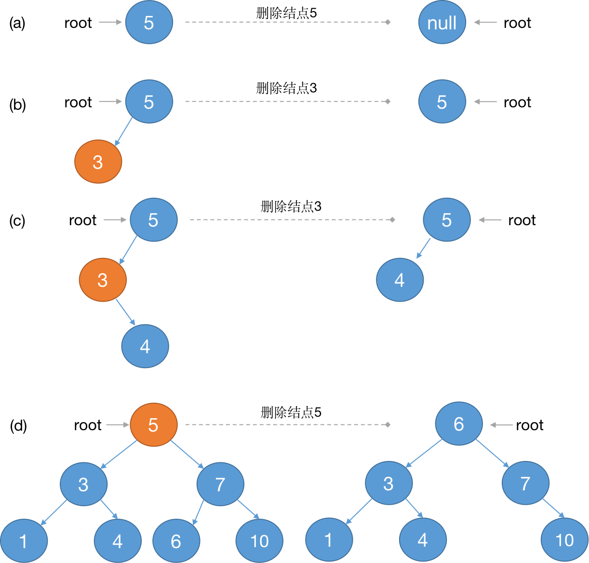

> 2021/4/6 by Hiya

# 二叉搜索树 (Binary Search Tree)

二叉搜索树是相较于顺序查找数组或链表的一种查找效率更为高效的数据结构。


<p style="text-align:center;color:#999;font-size:12px">图1</p>

- 一颗二叉搜索树是以一颗二叉树来组织的，每个结点都是一个对象，至少包含属性`key`（作为唯一标识，用于结点之间大小比较）、`left`（结点的左子树）、`right`（结点的右子树）。

- 对二叉搜索树的任意结点`node`，其左子树中最大的`key`不大于`node.key`，右子树中最小的`key`不小于`node.key`。

- 二叉搜索树按照中序遍历输出每个结点的`key`值，输出的结果是一个升序的数组。例如图1的二叉搜索树中序遍历，结果为：`[1,3,4,5,6,7,10]`

定义二叉搜索树的结点数据结构

```js
function TreeNode (key, value, p = null) {
  this.key = key
  this.value = value
  this.p = p
  this.left = this.right = null
}
```

说明：
- `key` - 结点唯一标识，也用于结点之间大小的对比判断
- `value` - 结点保存的数据
- `p` - 结点的父结点，根结点的父结点为`null`，即 `node.p=null`
- `left` - 结点的左孩子
- `right` - 结点的右孩子

定义二叉搜索树类

```js
class BST {
  constructor () {
    this.root = null  
  }
}
```

说明：
- `root` - 二叉搜索树的根结点

## 搜索结点

在`BST`类插入方法`search`

```js
class BST {

  search (key) {
    let node = this.root
    while(node) {
      if(node.key === key) {
        return node
      } else if(node.key > key) {
        node = node.left
      } else {
        node = node.right
      }
    }
    return node
  }
}
```

以上代码为循环迭代实现，从根结点开始向下查找，如果当前结点的key等于要查找的key值，表示结点已查找到，直接返回结点；否则根据key值得对比情况，决定是往左子树查找还是右子树查找，当前结点key值小于要查找的key，继续查找右子树，否则查找左子树。

递归实现：

```js
function search (node, key) {
  if(!node) return node
  if(node.key === key) return node
  if(node.key < key) {
    return search(node.right, key)
  } else {
    return search(node.left, key)
  }
}

class BST {
  search (key) {
    return search(this.root, key)
  }
}
```

根据于图1:
- 查找key为5的结点，查找路径为：`5`
- 查找key为4的结点，查找路径为：`5 --> 3 --> 4`
- 查找key为9的结点，查找路径为：`5 --> 7 --> 10 --> null`

## 最小最大结点

根据二叉搜索树的性质，一颗二叉搜索树的最小结点一定在根结点的左子树中，最大结点一定在根结点的右子树中。

代码如下：

```js
class BST {
  min (node) {
    node = node || this.root
    while(node && node.left) {
      node = node.left
    }
    return node
  }

  max (node) {
    node = node || this.root 
    while(node && node.right) {
      node = node.right
    }
    return node
  }
}
```

查找最小结点，只要向左子树中查找即可，即结点存在左子树，则继续往左子树中查找，直到左子树不存在；查找最大结点的操作与查找最小结点操作相反，只要向右子树中查找即可。

## 前驱/后继结点

### 前驱结点

在二叉搜索树中，一个结点的前驱结点有两种情况：

- 如果结点存在左子树，则当前结点的前驱结点在其左子树中，并且是左子树中的最大结点；
- 如果结点不存在左子树，则当前结点的前驱结点是其祖先结点，该祖先结点满足离当前结点最近，且该祖先结点的右孩子也是当前结点的祖先结点。


图1的二叉搜索树，结点6的前驱结点是5，结点5满足离6结点最近且其右孩子结点7是结点5的祖先结点。


<p style="text-align:center;color:#999;font-size:12px">图2</p>

代码实现：

```js
class BST {
  /** 前驱结点 */
  predecessor (key) {
    let node = this.search( key )
    if(!node) return node
    if(node.left) {
      // 如果存在左子树，则当前结点的前驱结点是其左子树中的最大结点
      return this.max(node)
    }
    let p = node.p
    // 沿着查找路径向上查找，直到找到第一个祖先结点的左结点不等于当前结点
    while(p !== null && node === p.left) {
      node = p
      p = p.p
    }
    return p
  }
}
```

### 后继结点

在二叉搜索树中，一个结点的后继结点有两种情况：

- 如果结点存在右子树，则当前结点的后继结点在其右子树中，并且是右子树中的最小结点；
- 如果结点不存在右子树，则当前结点的后继结点是其祖先结点，该祖先结点满足离当前结点最近，且该祖先结点的左孩子也是当前结点的祖先结点。

图1的二叉搜索树，结点4的后继结点是5，结点5满足离4结点最近且其左孩子结点3是结点4的祖先结点。


<p style="text-align:center;color:#999;font-size:12px">图3</p>

代码实现：

```js
class BST {
  /** 后继结点 */
  successor (key) {
    let node = this.search(key)
    if(!node) return node
    if(node.right) {
      // 如果存在右子树，则当前结点的后继结点是其右子树中的最小结点
      return this.min(node.right)
    }
    let p = node.p
    // 沿着查找路径向上查找，直到找到第一个祖先结点的右结点不等于当前结点
    while(p !== null && node === p.right) {
      node = p
      p = p.p
    }
    return p
  }
}
```

## 插入结点

在一颗二叉搜索树中插入结点，可能的情况：

- 二叉搜索树为空，此时插入的结点就是树的根结点
- 二叉树不为空，从根结点出发，对比插入结点的`key`值得大小。插入结点的`key`小于根结点，则往根结点的左子树向下对比，直到找到合适的插入位置；插入结点的`key`大于根结点，则往根结点的右子树向下对比，直到找到合适的插入位置


<p style="text-align:center;color:#999;font-size:12px">图4</p>

代码实现：

```js
class BST {
  put (key, value = undefined) {
    let p
    let node = this.root
    while(node !== null) {
      p = node
      if (node.key === key) {
        node.value = value
        return
      } else if(node.key > key) {
        node = node.left
      } else {
        node = node.right
      }
    }

    const newNode = new TreeNode( key, value, p)
    if(!p) {
      this.root = newNode
    } else if(p.key < newNode.key) {
      p.right = newNode
    } else {
      p.left = newNode
    }
  }
}
```

上面的代码采用循环迭代实现，在`while`循环中，循环比较结点与待插入结点`key`值的大小，并记录当前遍历的结点的父结点。当退出`while`循环时，根据记录的父结点情况进行结点的插入操作，如果父结点为空，表示树是空树，则插入的结点为根结点；父结点非空，则对比父结点与待插入结点的`key`值，决定待插入结点是父结点的左结点还是有结点

递归实现版本

```js
function putNode (n, key, value, p) {
  if(!n) {
    return new TreeNode(key, value, p)
  }
  if(n.key === key) {
    n.value = value
  } else if(n.key > key) {
    n.left = putNode(n.left, key, value, n)
  } else {
    n.right = putNode(n.right, key, value, n)
  }
  return n
}

class BST {
  this.root = putNode(this.root, key, value, null)
}
```

## 删除结点

二叉搜索树结点的删除操作相交于插入操作，会复杂一些。对于要删除的结点，记为`node`，`node`结点存在以下3种情况：

- `node`左右子树都不存在
- `node`存在左子树或右子树
- `node`左右子树都存在

对于二叉搜索树结点的删除，这里不使用将结点从树中删除的操作，而是用树中某个结点替换要删除的结点，既不破坏二叉搜索树的性质，同时达到删除的目的。


<p style="text-align:center;color:#999;font-size:12px">图5</p>

根据图5分析：

- (a)node没有孩子结点，简单删除它，并修改node的父结点，用null取代结点node
- (b)只有一个孩子，将这个孩子提升到node结点的位置，并修改node结点的父节点，用node的孩子替代node
- (c)有两个孩子，查找node的后继结点x（一定在右子树中），让x占据树中node的位置。node的右子树成为x的右子树，左子树成为x的左子树

```js
class BST {
  /**
   * 结点替换
   * @param {TreeNode} oldNode 
   * @param {TreeNode} newOld 
   */
  _transplant (oldNode, newOld) {
    if(oldNode.p === null) {
      this.root = newOld
    } else if(oldNode.p.left === oldNode) {
      oldNode.p.left = newOld
    } else {
      oldNode.p.right = newOld
    }
    if(newOld !== null) {
      newOld.p = oldNode.p
    }
  }

  delete (key) {
    const node = this.search(key)
    if(!node) return
    if(!node.left) {
      // 如果要删除的结点的左孩子为空，则用右孩子替换待删除的结点
      this._transplant(node, node.right)
    } else if(!node.right) {
      // 如果要删除的结点的右孩子为空，则用左孩子替换待删除的结点
      this._transplant(node, node.left)
    } else {
      // 获取删除的结点的后继结点
      const successorNode = this.min(node.right)
      if(successorNode.p !== node) {
        // 后继结点的父结点不是待删除的阶段
        // 将后继节点与其右孩子进行替换
        this._transplant(successorNode, successorNode.right)
        successorNode.right = node.right
        successorNode.right.p = successorNode
      }
      // 用后继节点替换待删除节点
      this._transplant(node, successorNode)
      successorNode.left = node.left
      successorNode.left.p = successorNode
    }
  }
}
```
