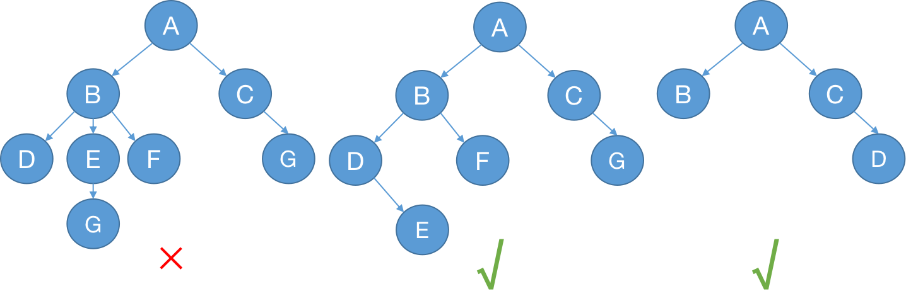
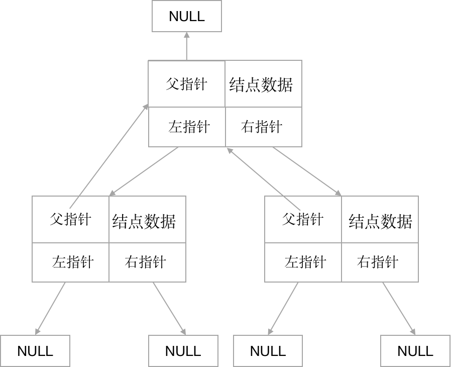
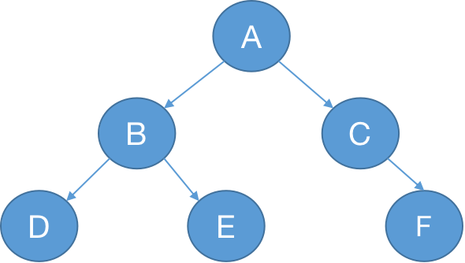

> by Hiya 2021/4/21

# 二叉树 （Binary Tree）

定义：每个结点至多只能有两个子结点的树。


<p style="text-align:center;color:#999;font-size:12px">图1</p>

## 二叉树的存储方式


<p style="text-align:center;color:#999;font-size:12px">图3</p>

定义结点数据结构

```js
function TreeNode (val) {
  this.val = val
  this.left = null   // 左孩子
  this.right = null  // 右孩子
  this.parent = null // 双亲结点，该字段可根据需要定义，这里保留该字段
}
```

## 二叉树遍历


<p style="text-align:center;color:#999;font-size:12px">图3</p>

以图3展示的树为例

### 深度优先遍历 （DFS）

> 从根节点出发，沿着左子树方向进行纵向遍历，直到找到叶子节点为止。然后回溯到前一个节点，进行右子树节点的遍历，直到遍历完所有可达节点为止。

深度优先遍历可借助栈实现。

遍历方法：
- 前序遍历
- 中序遍历
- 后续遍历

#### 前序遍历

遍历顺序，先遍历根结点，再遍历左孩子，最后遍历右孩子 **（中左右）**。

图3树的前序遍历结果：A, B, D, E, C, F

代码实现：

```js
// 递归实现
function preorder (root, result = []) {
  if(!root) return result
  result.push(root.val)
  preorder(root.left, result)
  preorder(root.right, result)
  return result
}
```

```js
// 迭代实现
function preorder (root) {
  const result = []
  if(!root) return result
  const stack = [root]
  while(stack.length) {
    const node = stack.pop()
    result.push(node.val)
    // 右孩子先入栈，左孩子后入栈，保证左孩子会先遍历
    node.right && stack.push(node.right)
    node.left && stack.push(node.left)
  }
  return result
}
```

#### 中序遍历

遍历顺序，先遍历左孩子，再遍历根结点，最后遍历右孩子 **（左中右）**。

图3树的中序遍历结果：D, B, E, A, C, F

代码实现：

```js
// 递归实现
function inorder (root, result=[]) {
  if(!root) return result
  inorder(root.left, result)
  result.push(root.val)
  inorder(root.right, result)
  return result
}
```

```js
// 迭代实现
function inorder (root) {
  const result = []
  if(!root) return result
  const stack = []
  let node = root
  while(node || stack.length) {
    if(node) {
      stack.push(node)
      node = node.left
    } else {
      node = stack.pop()
      result.push(node.val)
      node = node.right
    }
  }
  return result
}
```

*ps: 中序遍历迭代实现没法像递归实现一样，通过调整前序遍历某些代码执行顺序来实现。*

#### 后序遍历

图3树的后序遍历结果：D, E, B, F, C, A

遍历顺序，先遍历左孩子，再遍历右孩子，最后遍历根结点 **（左右中）**。

代码实现：

```js
// 递归实现
function postorder (root, result=[]) {
  if(!root) return result
  postorder(root.left, result)
  postorder(root.right, result)
  result.push(root.val)
  return result
}
```

```js
// 迭代实现
function postorder ( root ) {
  const result = []
  if ( !root ) return result
  const stack = [ root ]
  while ( stack.length ) {
    const node = stack.pop()
    result.push( node.val )
    node.left && stack.push( node.left )
    node.right && stack.push( node.right )
  }
  result.reverse()
  return result
}
```

先序遍历的遍历顺序是中左右，对于后序遍历的迭代实现，可以调整先序遍历迭代实现中左右孩子入栈顺序（左孩子先入栈，右孩子再入栈），最后对结果反转。

<div style="position:relative">
先序遍历中左右 -----<span style="color:#999;font-size: 10px;position: absolute;top: -10px;">调整左右孩子</span>-----------------> 中右左 -----<span style="color:#999;font-size: 10px;position: absolute;top: -10px;">反转</span>---------->  左右中
</div>

### 广度优先遍历 （BFS）

> 从根节点出发，在横向遍历二叉树层段节点的基础上纵向遍历二叉树的层次。

广度优先遍历可借助队列实现。

遍历方法：
- 层次遍历

#### 层次遍历

代码实现

```js
function levelOrder (root) {
  const result = []
  if(!root) return result
  const queue = [root]
  while(queue.length) {
    // 使用一个常量记录当前队列的长度，此时队列的长度是当前层级的结点数
    // 不能直接使用queue.length，因为队列的长度是不断变化的
    const size = queue.length
    for(let i=0; i<size; i++) {
      const node = queue.shift() // 出队
      result.push(node.val)
      // 左右孩子入队
      node.left && queue.push(node.left)
      node.right && queue.push(node.right)
    }
  }
  return result
}
```

## 二叉树的类型

### 满二叉树

### 完全二叉树

### 二叉搜索树

### 完全二叉搜索树