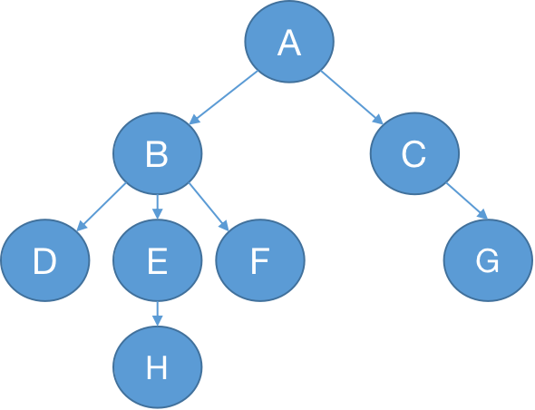

# 树

## 树的定义

- 有且仅有一个特定的称为根（root）的结点
- 当结点数量>1时，其余结点可分为若干个互不相交的有限集，其中每个集合也可以看作一颗树，称之为根的子树

### 度

结点拥有的子树的数量是为树的度。

### 路径

顺着结点的边从一个结点走到另一个结点，所经过的结点的顺序排列就称为“路径”。

### 结点间的关系

- 结点的子树的根称为该结点的孩子（child），衍生出该结点的结点称为该结点的双亲结点（parent）
- 由同一个结点衍生出的同一层结点互相称之为兄弟（sibling）
- 由同一个结点之下的所有结点称之为子孙

### 结点的层次

从根开始定义，根为第一层，根的子节点为第二层，以此类推。

### 深度

对于任意节点n,n的深度为从根到n的唯一路径长，根的深度为0

### 高度

对于任意节点n,n的高度为从n到一片树叶的最长路径长，所有树叶的高度为0

图1

图1中，B,C结点是A结点的孩子，A结点是B,C结点的双亲结点，B,C是兄弟结点，B的子孙结点有D,E,F,G

## 二叉树

- [二叉树](./javascript/leetcode/tree/bt/)

### 二叉搜索树

- [二叉搜索树](./javascript/leetcode/tree/bst/)

