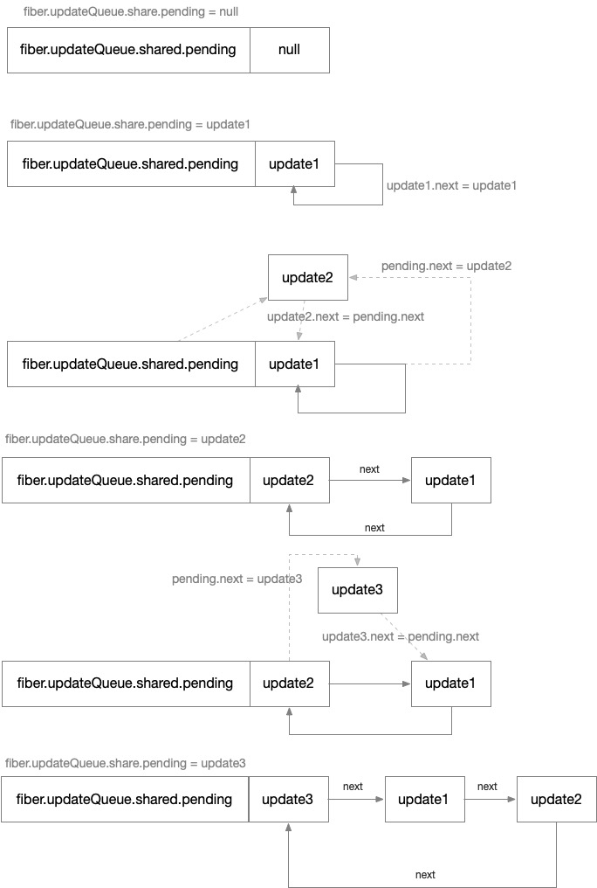
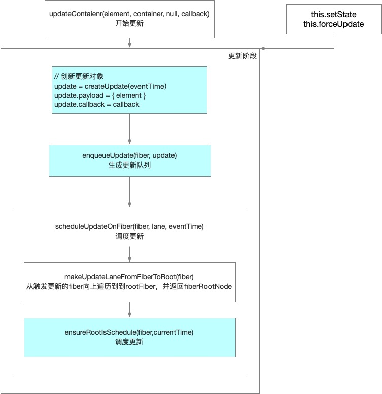
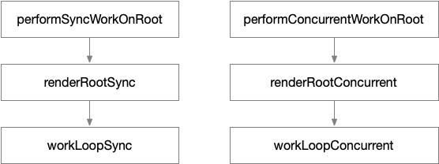
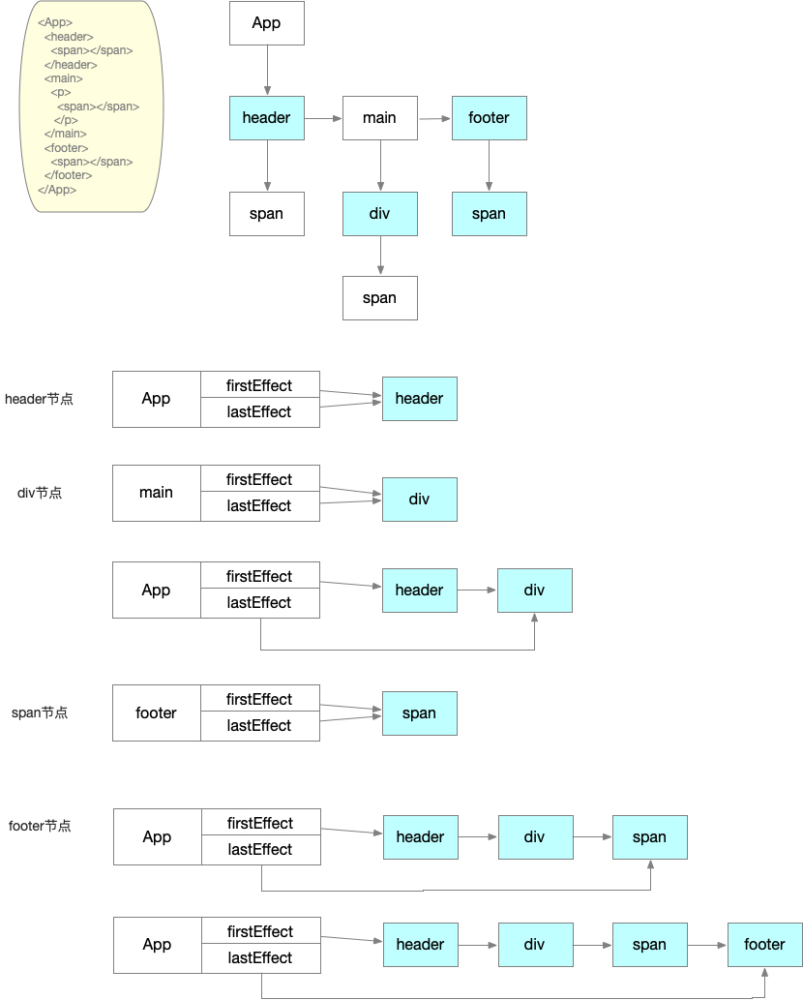
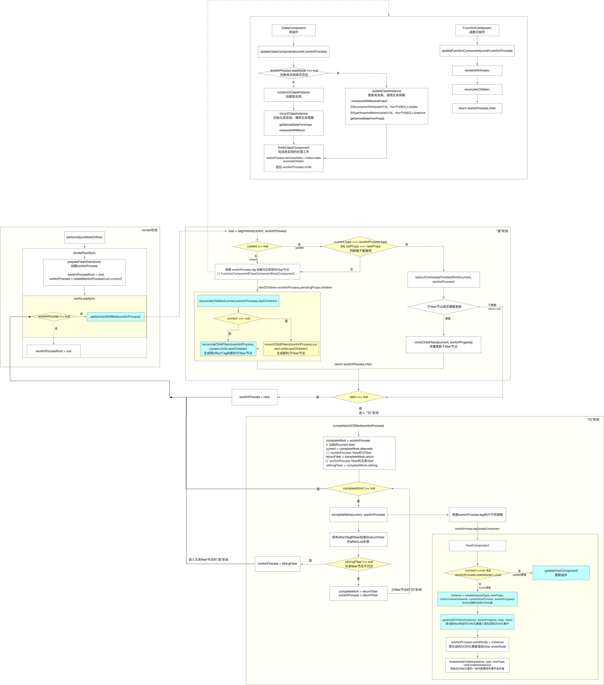

# React运行流程


React的整个运行流程可分为4个阶段：初始化阶段、更新阶段、render阶段、commit阶段。

初始化阶段仅在首次挂载应用时会执行，在该阶段会创建整个应用的根结点`fiberRoot`和组件树的根`rootFiber`。

初始化完成后进入更新阶段，更新阶段会在发生更新的`fiber`节点上创建更新对象，更新对象记录了要发生更新的变化状态，然后调度更新。

调度更新后，就进入了render阶段，render阶段是构建`fiber tree`的阶段。

当`fiber tree`构建完毕后，就进入commit阶段，commit阶段根据构建好的`fiber tree`，将相应的内容渲染到页面上。

## 初始化阶段

通常我们是通过`ReactDom.render`方法渲染整个React应用，`render`方法就是应用的入口，其内部调用`legacyRenderSubtreeIntoContainer`方法

代码
```js
/**
 * 应用渲染入口
 * @param {*} element 要渲染的React element节点
 * @param {*} container 要挂载的DOM节点
 * @param {*} callback 渲染完毕后的回调方法
 * @returns 
 */
function render(element, container, callback) {
  // ...
  return legacyRenderSubtreeIntoContainer(null, element, container, false, callback);
}
```

初始化阶段只在应用首次挂载才会执行，在React中，是如何判断是否是初始化？答案是通过判断`fiberRoot`是否存在。

代码
```js
function legacyRenderSubtreeIntoContainer(parentComponent, children, container, forceHydrate, callback) {
  // ...
  var root = container._reactRootContainer;
  var fiberRoot;

  if(!root) {
    // 初始化
  } else {
    // 更新
  }
}
```

在代码中是根据`root`变量是否存在进行判断，`root`可以理解为`fiberRoot`，但它的数据类型是这样的：
```ts
interface ReactDOMBlockingRoot {
  _internalRoot: FiberRootNode
}
```

变量`fiberRoot`才是直接指向`fiberRoot`，数据类型就是`FiberRootNode`。

现在来看一下初始化执行了什么操作：

```js
if(!root) {
  // 初始化
  root = container._reactRootContainer = legacyCreateRootFromDOMContainer(container, forceHydrate);
  fiberRoot = root._internalRoot;

  // ...

  unbatchedUpdates(function () {
    updateContainer(children, fiberRoot, parentComponent, callback);
  });  
}
```

可以看到变量`root`的值来源`legacyCreateRootFromDOMContainer`方法，如源码上看，主要是执行`new ReactDOMBlockingRoot(...)`创建了一个`ReactDOMBlockingRoot`对象：
```js
function ReactDOMBlockingRoot(container, tag, options) {
  this._internalRoot = createRootImpl(container, tag, options);
}
```

从代码中可以看出，实际上`fiberRoot`是执行`createRootImpl`方法后得到。现在我们跳过一些无关的过程，聚焦在`fiberRoot`是如何创建的。

查看或调试源码，从`createRootImpl`方法出发，到正在创建`fiberRoot`，可以得到函数调用栈：`createRootImpl` => `createContainer` => `createFiberRoot`。

最终可以知道，`fiberRoot`是在`createFiberRoot`中创建的，现在我们来查看代码实现

```js
function createFiberRoot(containerInfo, tag, hydrate, hydrationCallbacks) {
  // 创建fiberRoot
  var root = new FiberRootNode(containerInfo, tag, hydrate);
  // 创建rootFiber
  var uninitializedFiber = createHostRootFiber(tag);

  // 关联fiberRoot和rootFiber
  root.current = uninitializedFiber;
  uninitializedFiber.stateNode = root;

  // 初始化rootFiber节点上的更新队列对象
  initializeUpdateQueue(uninitializedFiber);

  // 返回fiberRoot
  return root;
}
```

`createFiberRoot`方法中执行的内容已经通过注释在上面的代码中进行说明，该方法主要创建了`fiberRoot` 和 `rootFiber`，并将两者关联起来。

代码执行到这里后，`fiberRoot`已创建完毕，调用的函数层层返回，最终给`legacyRenderSubtreeIntoContainer`方法中的变量`root`和`fiberRoot`赋上值。

程序执行到这里，代表着初始化阶段工作完毕，程序接下来将进入到更新阶段。


## 更新阶段

重新回到`legacyRenderSubtreeIntoContainer`方法：

```js
function legacyRenderSubtreeIntoContainer(parentComponent, children, container, forceHydrate, callback) {
  // ...
  var root = container._reactRootContainer;
  var fiberRoot;

  if(!root) { // 初始化
    // 创建fiberRoot
    root = container._reactRootContainer = legacyCreateRootFromDOMContainer(container, forceHydrate);
    fiberRoot = root._internalRoot;

    // ...

    unbatchedUpdates(function () {
      updateContainer(children, fiberRoot, parentComponent, callback);
    });
  } else { // 更新
    // 读取fiberRoot
    fiberRoot = root._internalRoot;

    // ...

    updateContainer(children, fiberRoot, parentComponent, callback);
  }
}
```

从代码中可以看出，无论是初始化的处理还是更新的处理，都会调用`updateContainer`方法。程序执行到调用`updateContainer`方式时，表示进入到更新阶段。

```js
function updateContainer(element, container, parentComponent, callback) {
  var current = container.current;

  // ...

  // 创建更新对象
  var update = createUpdate(eventTime, lane);

  update.payload = {
    element: element
  };
  callback = callback === undefined ? null : callback;

  if (callback !== null) {
    update.callback = callback;
  }

  // 生成更新队列
  enqueueUpdate(current, update);
  // 调度更新
  scheduleUpdateOnFiber(current, lane, eventTime);

  // ...
}
```

`updateContainer` 方法主要完成三件事：

- 创建更新对象，调用`createUpdate`方法
- 生成更新队列，调用`enqueueUpdate`方法
- 调度更新，调用`scheduleUpdateOnFiber`方法

### 创建更新对象

`createUpdate`方法的代码：
```js
function createUpdate(eventTime, lane) {
  var update = {
    // 任务时间
    eventTime: eventTime,
    // 优先级
    lane: lane,
    // 更新的类型
    tag: UpdateState,
    // 更新的数据
    payload: null,
    // 回调，对于HostRoot，会是ReactDOM.render的第三个参数
    callback: null,
    // 链接其他更新对象
    next: null
  };
  return update;
}
```

对于`HostRoot`，即通过`ReactDom.render`方法触发的更新，更新对象上挂载的更新数据是该方法的第一个参数，即`updateContainer`方法中的代码：`update.payload = {element}`

### 生成更新队列

创建完更新对象之后，会生成一个更新队列，下面是`enqueueUpdate`方法的代码：

```js
function enqueueUpdate(fiber, update) {
  var updateQueue = fiber.updateQueue;

  if (updateQueue === null) {
    return;
  }

  var sharedQueue = updateQueue.shared;
  var pending = sharedQueue.pending;

  if (pending === null) {
    update.next = update;
  } else {
    update.next = pending.next;
    pending.next = update;
  }

  sharedQueue.pending = update;
}
```

`enqueueUpdate`方法会将`createUpdate`创建的更新对象挂载到`fiber`节点的`fiber.updateQueue.shared.pending`上。

现在来看一下updateQueue的结构
```js
var queue = {
  // 本次更新前，fiber节点的状态
  baseState: fiber.memoizedState,
  // 本次更新前，fiber节点保存的update，以链表形式存在。firstBaseUpdate为链表头，lastBaseUpdate为链表尾
  firstBaseUpdate: null,
  lastBaseUpdate: null,
  shared: {
    // 触发更新的update会保证在shared.pending中，形成单向循环链表
    pending: null
  },
  // 数组。保存update.callback !== null的Update
  effects: null
};
```

`fiber.updateQueue`是一个链表，链接多个`update`对象，而产生多个`update`的原因是，`setState`可以同时触发多次，如下：

```js
handleClick () {
  this.setState({count: 2})
  this.setState({visible: false})
}
```

图解


### 调度更新

处理完更新队列之后，便调用`scheduleUpdateOnFiber`方法，开始进行调度更新。

```js
function scheduleUpdateOnFiber(fiber, lane, eventTime) {
  // ...

  var root = markUpdateLaneFromFiberToRoot(fiber, lane);

  // ...

  if (lane === SyncLane) {
    if ( // 检测是否在unbatchedUpdates中
    (executionContext & LegacyUnbatchedContext) !== NoContext && // 检查是否还没有渲染
    (executionContext & (RenderContext | CommitContext)) === NoContext) {
      // ...

      performSyncWorkOnRoot(root);  // ①
    } else {
      ensureRootIsScheduled(root, eventTime);

      // ...
    }
  } else {
    // ...

    ensureRootIsScheduled(root, eventTime);
  }
}
```

`markUpdateLaneFromFiberToRoot` 方法主要是从当前需要更新的`fiber`节点往上一直到`rootFiber`节点标记上相关的更新优先级信息，并返回`fiberRoot`节点。

对应首次渲染的React应用，会直接进入注释`①`所标记的方法`performSyncWorkOnRoot`，这里暂时不讨论该方法，因为从执行该方法开始，表示进入到了render结点。如果是由`setState`触发的更新，会调用`ensureRootIsScheduled`方法，这是决定更新是否能被执行的关键方法。

`ensureRootIsScheduled`方法会进行一些任务优先级的比较判断，确认是否需要更新，最后判断是启用同步更新方式还是异步更新方式。

```js
function ensureRootIsScheduled(root, currentTime) {
  // ...

  if (newCallbackPriority === SyncLanePriority) {
    newCallbackNode = scheduleSyncCallback(
      performSyncWorkOnRoot.bind(null, root),
    );
  } else if (newCallbackPriority === SyncBatchedLanePriority) {
    newCallbackNode = scheduleCallback(
      ImmediateSchedulerPriority,
      performSyncWorkOnRoot.bind(null, root),
    );
  } else {
    const schedulerPriorityLevel = lanePriorityToSchedulerPriority(
      newCallbackPriority,
    );
    newCallbackNode = scheduleCallback(
      schedulerPriorityLevel,
      performConcurrentWorkOnRoot.bind(null, root),
    );
  }

  // ...
}
```

### 在React中可以触发更新的操作

- `ReactDom.render` - 由HostRoot触发
- `this.setState` - 由ClassComponent触发
- `this.forceUpdate` - 由ClassComponent触发
- `useState` - 由FunctionComponent触发
- `useReducer` - 由FunctionComponent触发

上面讲的内容是`ReactDom.render`触发更新做的一些了操作，现在我们来看下ClassComponent触发更新所做的事情。

ClassComponent的更新可以由`this.setState`和`this.forceUpdate`触发，先看一下下面的代码：

```js
var classComponentUpdater = {
  isMounted: isMounted,
  enqueueSetState: function (inst, payload, callback) {
    var fiber = get(inst);
    var eventTime = requestEventTime();
    var lane = requestUpdateLane(fiber);
    var update = createUpdate(eventTime, lane);
    update.payload = payload;

    if (callback !== undefined && callback !== null) {
      // ...
      update.callback = callback;
    }

    enqueueUpdate(fiber, update);
    scheduleUpdateOnFiber(fiber, lane, eventTime);
    // ...
  },
  enqueueForceUpdate: function (inst, callback) {
    var fiber = get(inst);
    var eventTime = requestEventTime();
    var lane = requestUpdateLane(fiber);
    var update = createUpdate(eventTime, lane);
    update.tag = ForceUpdate;

    if (callback !== undefined && callback !== null) {
      // ...
      update.callback = callback;
    }

    enqueueUpdate(fiber, update);
    scheduleUpdateOnFiber(fiber, lane, eventTime);
    // ...
  }
}
```

在ClassComponent中，执行`this.setState()`相当于调用`classComponentUpdater.enqueueSetState`方法，执行`this.forceUpdate()`相当于调用`classComponentUpdater.enqueueForceUpdate`。

从代码中可以看出，`classComponentUpdater.enqueueSetState`和`classComponentUpdater.enqueueForceUpdate`是执行的内容是差不多的，都是创建一个新的更新对象、生成更新队列、调度更新。唯一区别就是前者会设置`payload`的值，值是`this.setState`的第一个参数，即要更新的新状态；后者不需要`payload`值，但会将`update.tag`设置为`ForceUpdate`，表示强制更新。

FunctionComponent的更新暂时不在这里讲解。

### 小结

流程图解



## render阶段

在更新阶段的内容中，我们知道`scheduleUpdateOnFiber`方法会调度起一次更新，在该方法中，会根据更新方式决定是启用同步更新`performSyncWorkOnRoot`还是异步更新`performConcurrentWorkOnRoot`。

`performSyncWorkOnRoot` 或者 `performConcurrentWorkOnRoot`方法的调用表示进入到了render阶段，这里暂时不讨论同步更新和异步更新的详细区别，从整体上看下这两个方法的区别：



`performSyncWorkOnRoot`最后会调用`workLoopSync`方法，`performConcurrentWorkOnRoot`最后会调用`workLoopConcurrent`方法：

```js
function workLoopSync() {
  while (workInProgress !== null) {
    performUnitOfWork(workInProgress);
  }
}

function workLoopConcurrent() {
  // Perform work until Scheduler asks us to yield
  while (workInProgress !== null && !shouldYield()) {
    performUnitOfWork(workInProgress);
  }
}
```

`workLoopSync` 和 `workLoopConcurrent` 方法的区别是，在`workLoopConcurrent`中会调用`shouldYield`，`shouldYield`会判断浏览器帧有没有剩余时间，如果没有，则会终止执行，直到有剩余时间才会继续执行循环。

 - `workInProgress` 是当前已经创建的需要被处理`workInProgress fiber`。

- `performUnitOfWork` 方法会处理当前已创建的`workInProgress fiber`，然后创建下一个`fiber`节点并赋值给`workInProgress`，并与已创建过的`workInProgress fiber`连接起来，构成`fiber tree`。

接下来的内容主要用`performSyncWorkOnRoot`方法讲解render阶段的工作流程。

在`workLoopSync`方法中，会根据`workInProgress`是否存在决定是否继续执行，那么`workInProgress`的首次赋值是在什么时候？

```js
function renderRootSync(root, lanes) {
  // ...
  if (workInProgressRoot !== root || workInProgressRootRenderLanes !== lanes) {
    prepareFreshStack(root, lanes);
    startWorkOnPendingInteractions(root, lanes);
  }
  // ...
  do {
    try {
      workLoopSync();
      break;
    } catch (thrownValue) {
      handleError(root, thrownValue);
    }
  } while (true);

  // ...
}

function prepareFreshStack(root, lanes) {
  // ...

  workInProgressRoot = root; // fiberRoot
  workInProgress = createWorkInProgress(root.current, null); // rootFiber
  
  // ...
}
```

现在来看一下`performUnitOfWork`方法：

```js
function performUnitOfWork(unitOfWork) {
  const current = unitOfWork.alternate;
  // ...

  let next;
  if (enableProfilerTimer && (unitOfWork.mode & ProfileMode) !== NoMode) {
    // ...
    next = beginWork(current, unitOfWork, subtreeRenderLanes);
    stopProfilerTimerIfRunningAndRecordDelta(unitOfWork, true);
  } else {
    next = beginWork(current, unitOfWork, subtreeRenderLanes);
  }

  // ...
  unitOfWork.memoizedProps = unitOfWork.pendingProps;
  if (next === null) {
    completeUnitOfWork(unitOfWork);
  } else {
    workInProgress = next;
  }

  // ...
}
```

在`performUnitOfWork`方法中，最主要是调用了`beginWork`和`completeUnitOfWork`方法，这两个方法分别完成`performUnitOfWork`方法的“递”和“归”工作。

- “递”阶段 - 从`rootFiber`开始向下深度优先遍历，为每个遍历到的`fiber`节点执行`beginWork`方法。`beginWork`方法会根据传入的`fiber`节点，创建新的子`fiber`节点，并连接两个`fiber`节点；然后进行子`fiber`节点的`beginWork`，如果没有子`fiber`节点，则会进入到“归”阶段。

- “归”阶段 - 当某个`fiber`节点没有子`fiber`节点，则会进入到“归”阶段，主要是执行`completeWork`方法，该方法执行完后，如果存在兄弟`fiber`节点(`fiber.sibling !== null`)，则会进入兄弟`fiber`节点的“递”阶段；否则进入到父级`fiber`节点（`fiber.return`）的“归”阶段。

“递”和“归”阶段交错执行，直到返回到`rootFiber`，表示render阶段结束。

### beginWork - “递”阶段

现在来看一下`beginWork`方法做了什么事情：

```js
/**
 * 
 * @param {Fiber} current 当前组件对应的在上一次更新时的fiber节点，即workInProgress.current
 * @param {Fiber} workInProgress 当前组件对应的fiber节点
 * @param {*} renderLanes 优先级相关
 * @returns 
 */
function beginWork( current, workInProgress, renderLanes) {
  // ...

  // 判断current是否存在
  // 若存在，表示update，会判断current节点是否能被复用
  // 不存在，表示mount，会根据workInProgress.tag创建不同类型的子fiber节点
  if(current !== null) {
    const oldProps = current.memoizedProps;
    const newProps = workInProgress.pendingProps;
    
    if(oldProps !== newProps || hasLegacyContextChanged() || workInProgress.type !== current.type) {
      didReceiveUpdate = true
    } else if(!includesSomeLane(renderLanes, updateLanes)) {
      didReceiveUpdate = false;
      switch (workInProgress.tag) {
        case HostRoot:
          // ...
        case HostComponent:
          // ...
        case ClassComponent:
          // ...
        // 其他类型
      }
      return bailoutOnAlreadyFinishedWork(current, workInProgress, renderLanes);
    } else {
      if ((current.flags & ForceUpdateForLegacySuspense) !== NoFlags) {
        didReceiveUpdate = true;
      } else {
        didReceiveUpdate = false;
      }
    }
  } else {
    didReceiveUpdate = false;
  }
  
  switch (workInProgress.tag) {
    case IndeterminateComponent:
      // ...
    case LazyComponent:
      // ...
    case FunctionComponent:
      // ...
    case ClassComponent:
      // ...
    case HostRoot:
      // ...
    case HostComponent:
      // ...
    // ... 其他组件类型
  }
}
```

当组件是首次渲染时，则其对应的上一次更新时的`fiber`节点不存在（即`current === null`），组件进行`mount`操作；经过`mount`的组件，在下一次渲染时，则进行`update`操作。

- `mount` 时主要根据`workInProgress.tag`创建不同类型的子`fiber`节点。
- `update` 时，当满足`oldProps === newProps && workInProcess.type === current.type` 和 `!includesSomeLane(renderLanes, updateLanes)`(这个和优先级有关)时，可以复用上一次更新时的子`fiber`节点，调用`bailoutOnAlreadyFinishedWork`方法。

#### mount

现在来看几个创建不同类型的子`fiber`节点的方法

```js
/** 更新函数式组件 */
function updateFunctionComponent(current, workInProgress, Component, nextProps, renderLanes) {
  // ...
  reconcileChildren(current, workInProgress, nextChildren, renderLanes);
  return workInProgress.child;
}

/** 更新原生组件 */
function updateHostComponent(current, workInProgress, renderLanes) {
  // ... 
  reconcileChildren(current, workInProgress, nextChildren, renderLanes);
  return workInProgress.child;
}

/** 更新类组件，由updateClassComponent方法调用 */
function finishClassComponent(current, workInProgress, Component, shouldUpdate, hasContext, renderLanes) {
  // ...
  if (current !== null && didCaptureError) {
    forceUnmountCurrentAndReconcile(current, workInProgress, nextChildren, renderLanes);
  } else {
    reconcileChildren(current, workInProgress, nextChildren, renderLanes);
  }
  // ...
  return workInProgress.child;
}
```

从上面几个方法可以看到，基本都会调用`reconcileChildren`方法：

```js
function reconcileChildren(current, workInProgress, nextChildren, renderLanes) {
  if (current === null) {
    workInProgress.child = mountChildFibers(workInProgress, null, nextChildren, renderLanes);
  } else {
    workInProgress.child = reconcileChildFibers(workInProgress, current.child, nextChildren, renderLanes);
  }
}
```

`reconcileChildren`方法是React的`Reconciler`模块的核心部分，主要做：

- 对于首次渲染的组件（`mount`，即`current===null`），创建新的子`fiber`节点。

- 对应更新的组件（`update`，即`current!==null`），会将当前更新的组件与上次更新时的组件做对比（`diff`算法），根据比较结果生成新的子`fiber`节点。（关于diff的内容不在这里展开讲解）

#### update

前面提到过，当满足一定条件时，则不会创建新的子`fiber`节点，而是复用上一次更新对应的`fiber`节点的子`fbier`节点，执行update逻辑，否则执行mount逻辑。

update逻辑主要调用`bailoutOnAlreadyFinishedWork`方法:

```js
function bailoutOnAlreadyFinishedWork(current, workInProgress, renderLanes) {
  // ...
  
  if (!includesSomeLane(renderLanes, workInProgress.childLanes)) {
    // children没有发生变化，直接跳过不处理。
    return null;
  } else {
    // 当前fiber没有变化，但其子fiber发生变化，克隆负责子fiber节点
    cloneChildFibers(current, workInProgress);
    return workInProgress.child;
  }
}
```

更新复用子`fiber`节点主要通过`cloneChildFibers`克隆负责上一次更新对应的`fiber`节点的子`fiber`节点。

```js
function cloneChildFibers(current, workInProgress) {
  // ...

  if (workInProgress.child === null) {
    return;
  }

  var currentChild = workInProgress.child;
  var newChild = createWorkInProgress(currentChild, currentChild.pendingProps);
  workInProgress.child = newChild;
  newChild.return = workInProgress;

  // 存在兄弟`fiber`节点，继续复制
  while (currentChild.sibling !== null) {
    currentChild = currentChild.sibling;
    newChild = newChild.sibling = createWorkInProgress(currentChild, currentChild.pendingProps);
    newChild.return = workInProgress;
  }

  newChild.sibling = null;
}
```

### completeWork - “归”阶段

当`fiber`节点没法继续向下执行`beginWork`，即`fiber.child`不存在，表示当前“递”阶段结束，“归”阶段开始。重新回到`performUnitOfWork`方法：

```js
function performUnitOfWork(unitOfWork) {
  // ...
  if (next === null) {
    completeUnitOfWork(unitOfWork);
  } else {
    workInProgress = next;
  }
  // ...
}
```

`next`变量由`beginWork`方法执行返回，当为空时，则调用`completeUnitOfWork`方法，表示“归”阶段开始。

```js
function completeUnitOfWork(unitOfWork) {
  var completedWork = unitOfWork;
  do {
    var current = completedWork.alternate;
    var returnFiber = completedWork.return; 

    if((completedWork.flags & Incomplete) === NoFlags) {
      setCurrentFiber(completedWork)
      var next

      /* ① */
      // 调用completeWork方法，
      if ( (completedWork.mode & ProfileMode) === NoMode) {
        next = completeWork(current, completedWork, subtreeRenderLanes);
      } else {
        next = completeWork(current, completedWork, subtreeRenderLanes);

        // ...
      }

      if (next !== null) {
        workInProgress = next;
        return;
      }

      /* ② */ 
      if (returnFiber !== null && (returnFiber.flags & Incomplete) === NoFlags) {
        // 当前fiber节点的后代fiber节点若发生变化，会形成一条链表挂载到当前fiber节点上
        if (returnFiber.firstEffect === null) {
          returnFiber.firstEffect = completedWork.firstEffect;
        }

        if (completedWork.lastEffect !== null) {
          if (returnFiber.lastEffect !== null) {
            returnFiber.lastEffect.nextEffect = completedWork.firstEffect;
          }

          returnFiber.lastEffect = completedWork.lastEffect;
        } 

        var flags = completedWork.flags;

        if (flags > PerformedWork) {
          if (returnFiber.lastEffect !== null) {
            returnFiber.lastEffect.nextEffect = completedWork;
          } else {
            returnFiber.firstEffect = completedWork;
          }

          returnFiber.lastEffect = completedWork;
        }
      }
    } else {
      // ...
    }

    /* ③ */ 
    // 存在兄弟fiber节点，进入兄弟fiber节点的beginWork
    var siblingFiber = completedWork.sibling;
    if (siblingFiber !== null) {
      workInProgress = siblingFiber;
      return;
    }

    // 父fiber节点的completeWork
    completedWork = returnFiber;
    workInProgress = completedWork;
  } while(completedWork !== null)

  // ...
}
```

`completeUnitOfWork`方法所做的事主要可以分为三部分：

- 调用`completeWork`方法，根据`workInProgress.tag`做不同处理。代码中注释`①`所示位置。
- 构建`effectList`链表。代码中注释`②`所示位置
- 进入兄弟`fiber`节点的“递”阶段，或者进入父`fiber`节点的“归”节点。代码中注释`③`所示位置

#### `completeWork`

```js
function completeWork(current, workInProgress, renderLanes) {
  var newProps = workInProgress.pendingProps;
  switch (workInProgress.tag) {
    case IndeterminateComponent:
    case LazyComponent:
    case SimpleMemoComponent:
    case FunctionComponent:
    case ForwardRef:
    case Fragment:
    case Mode:
    case Profiler:
    case ContextConsumer:
    case MemoComponent:
      return null;
    case ClassComponent:
      // ...
      return null
    case HostComponent:
      // ...
      if (current !== null && workInProgress.stateNode != null) { // update
        updateHostComponent(current, workInProgress, type, newProps, rootContainerInstance);
        if (current.ref !== workInProgress.ref) {
          markRef(workInProgress);
        }
      } else { // mount
        // ...

        // 创建DOM元素
        var instance = createInstance(type, newProps, rootContainerInstance, currentHostContext, workInProgress);
        // 将后代的DOM元素插入到创建好的DOM元素中
        appendAllChildren(instance, workInProgress, false, false);
        // DOM元素赋值给 workInProgress.stateNode 
        workInProgress.stateNode = instance;

        // 处理props
        if (finalizeInitialChildren(instance, type, newProps, rootContainerInstance)) {
          markUpdate(workInProgress);
        }

        // ...
      }
      // ...
      return null
    // 其他类型
  }
}
```

在`completeWork`方法中，先关注`HostComponent`的处理。`HostComponent`对应原生DOM组件，是要被渲染到页面上的。

`HostComponent`的处理也分为`mount`和`update`，根据`current !== null && workInProgress.stateNode != null` 进行判断。

- `update`时，主要调用`updateHostComponent`方法。由于更新阶段不需要创建DOM元素，主要处理组件的`props`，比如：`onClick`、`onChange`等事件属性，`style`属性，`children`属性等

- `mount`时，主要创建一个DOM元素，再将对应的后代DOM元素插件到刚生成的DOM元素中，并将DOM元素赋值给`workInProgress.stateNode`，再处理组件的`props`，类似`updateHostComponent`方法处理`props`的过程。

#### `effectList`

`effectList`是一个链表，记录了所有发生变化的`fiber`节点，在后续的commit阶段将会使用`effectList`处理所有变化的`fiber`节点。使用`effectList`链表，可以避免在commit阶段遍历整颗`fiber tree`，提高运行效率。需要注意的是，对于首次渲染的`fiber tree`，并不会构建`effectList`链表。

`effectList`工作原理：在`fiber`节点进行`beginWork`时，如果发生变化，会被打上相应的标记`fiber.flags`；执行完`completeWork`，会将当前变化的`fiber`节点链接到父`fiber`节点的`firstEffect`和`lastEffect`。接着进入父`fiber`节点的`completeWork`，如果子`fiber`节点存在`firstEffect`和`lastEffect`，则赋值给父`fiber`节点。



### 小结



## commit阶段

在render阶段处理完所有`fiber`节点之后，将会进入到commit阶段。在commit节点，主要执行类组件的相关生命周期、函数式组件的hook、以及将`fiber`节点对应的DOM元素渲染到页面上等。

现在来看一下是如何进入到commit阶段：
```js
function performSyncWorkOnRoot(root) {
  // ...

  var finishedWork = root.current.alternate;
  root.finishedWork = finishedWork;
  root.finishedLanes = lanes;
  commitRoot(root); 

  // ...
}
```

当调用`commitRoot`方法，表示进入到了commit阶段。`commitRoot`方法主要执行`commitRootImpl`方法。

```js
function commitRootImpl(root, renderPriorityLevel) {
  do {
    flushPassiveEffects();
  } while (rootWithPendingPassiveEffects !== null);

  // ...
 
  // root是fiberRoot，finishedWork是rootFiber
  var finishedWork = root.finishedWork;
  var lanes = root.finishedLanes;

  // ...

  // 重置一些全局变量
  if (root === workInProgressRoot) {
    workInProgressRoot = null;
    workInProgress = null;
    workInProgressRootRenderLanes = NoLanes;
  }

  // 将effectList赋值给firstEffect
  var firstEffect;
  if (finishedWork.flags > PerformedWork) {
    if (finishedWork.lastEffect !== null) {
      finishedWork.lastEffect.nextEffect = finishedWork;
      firstEffect = finishedWork.firstEffect;
    } else {
      firstEffect = finishedWork;
    }
  } else {
    firstEffect = finishedWork.firstEffect;
  }

  if(firstEffect !== null) {
    // ①  before mutation阶段
    nextEffect = firstEffect;
    do {
      {
        invokeGuardedCallback(null, commitBeforeMutationEffects, null);
        // ...
      }
    } while (nextEffect !== null);

    // ②  mutation阶段
    nextEffect = firstEffect;
    do {
      {
        invokeGuardedCallback(null, commitMutationEffects, null, root, renderPriorityLevel);
      }
    } while (nextEffect !== null);

    // ③  layout阶段
    root.current = finishedWork;  // 完成workInProgress fiber tree 切换成current fiber tree
    nextEffect = firstEffect;
    do {
      {
        invokeGuardedCallback(null, commitLayoutEffects, null, root, lanes);
      }
    } while (nextEffect !== null);

    // ...
  }
}
```

以上代码是`commitRootImpl`方法的主要内容，整个commit阶段可分为三个阶段：

- before mutation阶段，进入`commitBeforeMutationEffects`方法
- mutation阶段，进入`commitMutationEffects`方法
- layout阶段，进入`commitLayoutEffects`方法

在进入before mutation阶段之前，会有一些准备工作，初始化或重置一些变量。在上个章节有提到，在render阶段时会生成一个`effectList`链表，在commit阶段时，则会将`effectList`赋值给`firstEffect`变量，如代码所示：

```js
var firstEffect;
if (finishedWork.flags > PerformedWork) {
  if (finishedWork.lastEffect !== null) {
    finishedWork.lastEffect.nextEffect = finishedWork;
    firstEffect = finishedWork.firstEffect;
  } else {
    firstEffect = finishedWork;
  }
} else {
  firstEffect = finishedWork.firstEffect;
}
```

需要注意的是，由于`fiber`节点的`effectList`只记录了其发生变化的后代`fiber`节点。如果`rootFiber`本身发生了变化（如首次渲染时），需要将其放到`rootFiber`记录的`effectList`链表的末尾，保证所有变化的`fiber`节点不会遗漏。

### before mutation阶段

现在来看一下 before mutation阶段主要执行的方法`commitBeforeMutationEffects`:

```js
function commitBeforeMutationEffects() {
  while (nextEffect !== null) {
    var current = nextEffect.alternate;

    // 处理DOM节点渲染/删除后的 autoFocus、blur逻辑
    if (!shouldFireAfterActiveInstanceBlur && focusedInstanceHandle !== null) {
      if ((nextEffect.flags & Deletion) !== NoFlags) {
        if (doesFiberContain(nextEffect, focusedInstanceHandle)) {
          shouldFireAfterActiveInstanceBlur = true;
        }
      } else {
        if (nextEffect.tag === SuspenseComponent && isSuspenseBoundaryBeingHidden(current, nextEffect) && doesFiberContain(nextEffect, focusedInstanceHandle)) {
          shouldFireAfterActiveInstanceBlur = true;
        }
      }
    }

    var flags = nextEffect.flags;

    // 执行类组件的 getSnapshotBeforeUpdate 生命周期狗子
    if ((flags & Snapshot) !== NoFlags) {
      setCurrentFiber(nextEffect);
      commitBeforeMutationLifeCycles(current, nextEffect);
      resetCurrentFiber();
    }

    // 调度函数式组件的useEffect
    if ((flags & Passive) !== NoFlags) {
      if (!rootDoesHavePassiveEffects) {
        rootDoesHavePassiveEffects = true;
        scheduleCallback(NormalPriority$1, function () {
          flushPassiveEffects();
          return null;
        });
      }
    }

    nextEffect = nextEffect.nextEffect;
  }
}
```

`commitBeforeMutationEffects`方法主要做三件事：

- 处理DOM节点渲染/删除后的 `autoFocus`、`blur`逻辑
- 执行类组件的 `getSnapshotBeforeUpdate` 生命周期狗子
- 调度函数式组件的`useEffect`

### mutation阶段

接下来进入到了mutation阶段，看一下`commitMutationEffects`方法：

```js
function commitMutationEffects(root, renderPriorityLevel) {
  while (nextEffect !== null) {
    setCurrentFiber(nextEffect);
    var flags = nextEffect.flags;

    // 根据 ContentReset flags重置文字节点
    if (flags & ContentReset) {
      commitResetTextContent(nextEffect);
    }

    // 更新ref
    if (flags & Ref) {
      var current = nextEffect.alternate;
      if (current !== null) {
        commitDetachRef(current);
      }
    }

    var primaryFlags = flags & (Placement | Update | Deletion | Hydrating);

    switch (primaryFlags) {
      case Placement: // 插入DOM
          commitPlacement(nextEffect); 
          nextEffect.flags &= ~Placement;
          break;
      case PlacementAndUpdate: // 插入并更新DOM
          commitPlacement(nextEffect); 
          nextEffect.flags &= ~Placement;
          var _current = nextEffect.alternate;
          commitWork(_current, nextEffect);
          break;
      case Update:   // 更新DOM
        var _current3 = nextEffect.alternate;
          commitWork(_current3, nextEffect);
          break;
      case Deletion: // 删除DOM
          commitDeletion(root, nextEffect);
          break;
      // ...
    }
    resetCurrentFiber();
    nextEffect = nextEffect.nextEffect;
  }
}
```

mutation阶段是操作真实DOM元素的阶段，在该阶段，主要做一下事情：

- 根据 ContentReset flags重置文字节点
- 更新ref（解绑）
- 根据flags对DOM元素执行不同操作（`Placement|Update|Deletion|...`）

#### Placement - 插入DOM元素

对于`flags`为`Placement`，调用`commitPlacement`方法处理。

```js
function commitPlacement(finishedWork) {
  // 获取父级DOM元素
  var parentFiber = getHostParentFiber(finishedWork);
  var parentStateNode = parentFiber.stateNode;

  // ...

  // 获取兄弟DOM元素
  var before = getHostSibling(finishedWork);

  // 根据兄弟DOM元素是否存在决定调用parentNode.insertBefore或parentNode.appendChild执行DOM元素插入操作
  if (isContainer) {
    insertOrAppendPlacementNodeIntoContainer(finishedWork, before, parent);
  } else {
    insertOrAppendPlacementNode(finishedWork, before, parent);
  }
}
```

`commitPlacement`方法的主要工作内容为：

1. 获取父级DOM元素。
2. 获取兄弟DOM元素。
3. 根据兄弟DOM元素是否存在决定调用parentNode.insertBefore或parentNode.appendChild执行DOM元素插入操作

需要注意的是，获取兄弟DOM元素是一个耗时，因为`fiber tree` 和 `DOM tree`并不是一一对应关系。

#### Update - 更新DOM元素

对于`flags`为`Update`，调用`commitWork`方法处理。

`commitWork`主要处理`fiber.tag`为`HostComponent`的`fiber`节点，对于`HostComponent`，会调用`commitUpdate`方法：

```js
function commitUpdate(domElement, updatePayload, type, oldProps, newProps, internalInstanceHandle) {
  // 更新fiber节点的属性
  updateFiberProps(domElement, newProps); 
  // 更新DOM元素的属性
  updateProperties(domElement, updatePayload, type, oldProps, newProps);
}
```

`commitUpdate`会将`fiber`节点上记录的`updateQueue`中的新状态更新到页面上。

#### Deletion - 删除DOM元素

对于`flags`为`Deletion`，调用`commitDeletion`方法处理。

```js
function commitDeletion(finishedRoot, current, renderPriorityLevel) {
  unmountHostComponents(finishedRoot, current);

  var alternate = current.alternate;
  detachFiberMutation(current);

  if (alternate !== null) {
    detachFiberMutation(alternate);
  }
}
```

`commitPlacement`方法的主要调用`unmountHostComponents`方法，该方法主要做一下工作：

- 递归调用当前`fiber`节点及其后代`fiber`节点中`fiber.tag`为`ClassComponent`的节点的`componentWillUnmount`生命周期钩子
- 从页面上移除当前`fiber`节点对应的DOM元素
- 解绑`ref`
- 调度`useEffect`的销毁函数


### layout阶段

最后是layout阶段，在进入`commitLayoutEffects`方法前，一个比较重要的点是，**完成了双缓存树的切换，即`workInProgress fiber tree` 切换成`current fiber tree`，代码：`root.current = finishedWork`**。

现在来看一下`commitLayoutEffects`方法：

```js
function commitLayoutEffects(root, committedLanes) {
  while (nextEffect !== null) {
    setCurrentFiber(nextEffect);
    var flags = nextEffect.flags;

    // 执行相关生命周期钩子或hook
    if (flags & (Update | Callback)) {
      var current = nextEffect.alternate;
      commitLifeCycles(root, current, nextEffect);
    }

    // 赋值ref
    if (flags & Ref) {
      commitAttachRef(nextEffect);
    }

    resetCurrentFiber();
    nextEffect = nextEffect.nextEffect;
  }
}
```

在layout阶段，主要完成：

- 执行相关生命周期钩子或hook，调用`commitLifeCycles`方法
```js
function commitLifeCycles(finishedRoot, current, finishedWork, committedLanes) {
  switch (finishedWork.tag) {
    case FunctionComponent:
    case ForwardRef:
    case SimpleMemoComponent:
    case Block:
      // 执行useLayoutEffect的回调函数
      commitHookEffectListMount(Layout | HasEffect, finishedWork);
      // 调度useEffect的销毁函数与回调函数
      schedulePassiveEffects(finishedWork);
      return;
    case ClassComponent:
      var instance = finishedWork.stateNode;
      if (finishedWork.flags & Update) {
        if(current === null) {
          // ...

          // 执行componentDidMount生命周期钩子
          instance.componentDidMount()
        } else {
          // ...

          // 执行componentDidUpdate生命周期钩子
          instance.componentDidUpdate(prevProps, prevState, instance.__reactInternalSnapshotBeforeUpdate)
        }
      }
  }
}
```

- 为ref赋值，调用`commitAttachRef`方法
```js
function commitAttachRef(finishedWork) {
  var ref = finishedWork.ref;

  if (ref !== null) {
    var instance = finishedWork.stateNode;
    var instanceToUse;

    // 获取DOM示例
    switch (finishedWork.tag) {
      case HostComponent:
        instanceToUse = getPublicInstance(instance);
        break;

      default:
        instanceToUse = instance;
    } // Moved outside to ensure DCE works with this flag

    if (typeof ref === 'function') {
      // 如果ref是函数形式，调用回调函数
      ref(instanceToUse);
    } else { 
      // 如果ref是ref实例形式，赋值ref.current
      ref.current = instanceToUse;
    }
  }
}
```

### 小结

