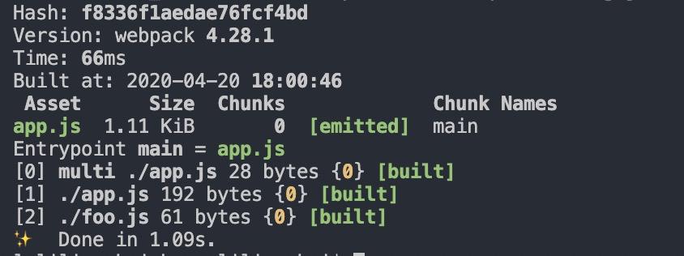

# Webpack

> webpack 是一个现代 JavaScript 应用程序的静态模块打包工具。当 webpack 处理应用程序时，它会在内部构建一个 依赖图(dependency graph)，此依赖图会映射项目所需的每个模块，并生成一个或多个 bundle。


## 模块

> 在 模块化编程 中，开发者将程序分解为功能离散的 chunk(discrete chunks of functionality)，并称之为_模块_。

对于 `Webpack` 而言，模块是非常重要的概念，与`node`的模块相比，`webpack`的模块概念更为广泛，以下示例对`webpack`来说都是模块：

- ES2015 `import` 语句
- CommonJS `require()` 语句
- AMD `define` 和 `require` 语句
- css/sass/less 文件中的 `@import` 语句。
- 样式(`url(...)`)或 HTML 文件(``)中的图片链接

## 基本概念

### 入口（`entry`）

入口（`entry`）是告诉`webpack`打包要以哪个文件作为入口文件去构建整个应用的依赖图，通过入口文件，`webpack`会寻找到相关（直接或间接）的依赖模块。入口文件一般是一个应用（模块）的起始文件。

在`webpack`中，`entry`的默认值是`./src/index.js`。

### 输出（`output`）

有输入便有输出，在`webpack`中，输出便是`output`，`output`用于告诉`webpack`在哪输出打包的产物，以及如何命名。在`webpack`中，主要文件输出的默认值是`./dist/main.js`。

在简单了解了`entry`和`output`的相关概念后，我们用一个简单的小例子说明一下如何使用这两个配置。

新建一个目录`webpack-demo`，在该目录下新建`app.js`文件和`webpack.config.js`文件。

```js
// app.js
const foo = require('./foo')
const APP = 'APP'
console.log(APP)
const mk = {
  on () {
    console.log('on')
  },
  emit () {
    foo()
  }
}
mk.on()
setTimeout(() => {
  mk.emit()
}, 1000)

// foo.js
function foo() {
  console.log('foo')
}
module.exports = foo
```

编写`webpack.config.js`文件

```js
const path = require('path')
module.exports = {
  entry: path.join(__dirname, 'app.js'),
  output: {
    path: path.join(__dirname, 'dist'),
    filename: 'app.js'
  }
}
```

- `entry` 接受入口文件的绝对路径字符串，或者相对于入口文件上下文环境`context`（默认是当前目录`cwd`）的相对路径。
- `output` 的值是一个对象，`path`指定输出到哪个目录，`filename`指定输出的bundle文件名。

完成上面文件的编写后，还需要安装 `webpack` 依赖才能打包，安装依赖：

```
yarn add webpack -D
```

安装完依赖后可以执行下面的命令打包文件：

```
webpack -c webpack.config.js
```

控制台输出以下信息表示打包成功：




## 相关阅读

- [Webpack 之 loader](./javascript/webpack/loader/)

## 参考资料

- [webpack](https://webpack.docschina.org/)
