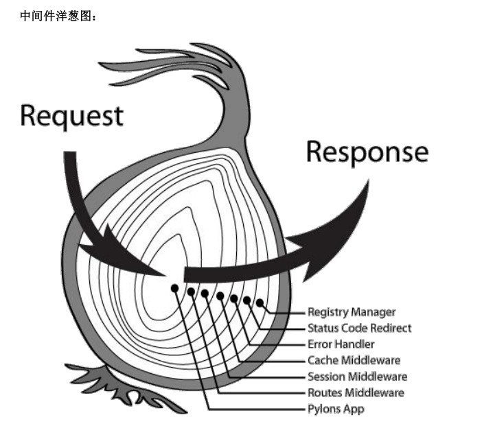

# Koa

Koa -- 基于 Node.js 平台的下一代 web 开发框架

### 一、认识Koa

**简介**：Koa 是一个新的 web 框架，由 Express 幕后的原班人马打造， 致力于成为 web 应用和 API 开发领域中的一个更小、更富有表现力、更健壮的基石。 通过利用 async 函数，Koa 帮你丢弃回调函数，并有力地增强错误处理。 Koa 并没有捆绑任何中间件， 而是提供了一套优雅的方法，帮助您快速而愉快地编写服务端应用程序。 

开发思路同 express 差不多，最大的特点是可以避免异步嵌套。

**网站**：

https://koa.bootcss.com/

https://www.npmjs.com/package/koa


### 二、使用Koa

1、安装

开发 Koa2 之前，Node.js 必须 8.x 版本以上

安装 Koa

```
cnpm i koa --save
```

例子：

```
const koa = require('koa');
const app = new koa();

//配置中间件
app.use(async (ctx) => {
    ctx.body = 'hello koa;';
})

app.listen(3000);
```


### 三、Koa 路由、get传值、动态路由

#### 1、Koa 路由

Koa 中的路由和 Express 有所不同，在项目中直接引入 Express 就可以配置路由，在 Koa 中需要安装 **koa-router** 路由模块：

```
cnpm i koa-router --save
```

使用：

```
const koa = require('koa');
const Router = require('koa-router');
let app = new koa();
let router = new Router();

//配置路由
router.get('/', async (ctx) => {
	ctx.body = 'Index';
}).get('/news', async (ctx) => {
	ctx.body = 'News';
});

app.use(router.routes()) //启动路由
app.use(router.allowedMethods());
/* 
作用： 这是官方文档的推荐用法,我们可以看到 router.allowedMethods()用在了路由匹配 router.routes()之后,所以在当所有路由中间件最后调用.此时根据 ctx.status 设置 response 响应头
*/

app.listen(3000);
```

#### 2、get 传值

在 Koa2 中 get 传值通过 request 接收，但是接收的方法有两种：

**query** ：返回的是格式化好的参数对象。

**querystring**：返回的是请求字符串

例子：

```
router.get('/news', async (ctx) => {
	//获取get请求数据
	console.log('ctx.query: ', ctx.query);
	console.log('ctx.querystring: ', ctx.querystring);

	console.log('ctx.request.query: ', ctx.request.query);
	console.log('ctx.request.querystring: ', ctx.request.querystring);

	ctx.body = 'News';
});
```

#### 3、动态路由

```
//动态路由
router.get('/newscontent/:aid', async (ctx) => {
	let aid = ctx.params.aid;
	ctx.body = 'News Content ' + aid;
})
```


### 四、Koa 中间件

#### 1、中间件

koa 中间件类似 express 的中间件

**功能**：

- 执行任何代码
- 修改请求和响应对象
- 终结请求-响应循环
- 调用堆栈中的下一个中间件

#### 2、中间件类型

应用级中间件

```
app.use(async (ctx, next) => {
	ctx.body = 'hello koa';
	await next();
});
```

路由级中间件

```
router.get('/', async (ctx, next) => {
	ctx.body = 'Index';
	await next();
})
```

错误处理中间件

```
app.use(async (ctx,next)=> {
    next();
    if(ctx.status==404){
   	 	ctx.status = 404;
   	 	ctx.body="这是一个 404 页面"
    }
});
```

第三方中间件

#### 3、koa 中间件的执行

洋葱圈模型



```
app.use(async (ctx, next) => {
	console.log('1 ==> 第一个中间件');
	await next();

	if(ctx.status==404){
   	 	ctx.status = 404;
   	 	ctx.body="这是一个 404 页面"
    }
});

app.use(async (ctx, next) => {
	console.log('2 ==> 第二个中间件');
	await next();

	console.log('6 ==> 返回第二个中间件');
});

app.use(async (ctx, next) => {
	console.log('3 ==> 第三个中间件');
	await next();

	console.log('5 ==> 返回第三个中间件');
});

app.use(async (ctx, next) => {
	console.log('4 ==> 第四个中间件');
	ctx.body = 'hello koa';
});

/*
1 ==> 第一个中间件
2 ==> 第二个中间件
3 ==> 第三个中间件
4 ==> 第四个中间件
5 ==> 返回第三个中间件
6 ==> 返回第二个中间件

*/
```


### 五、koa-static 静态资源托管

1、安装 koa-static

```
cnpm i koa-static --save
```

2、引入配置中间件

```
const static = require('koa-static');
app.use(static('public')); //可以设置多个
```


### 六、Koa post提交数据

1、安装 koa-bodyparser

```
cnpm i koa-bodyparser
```

2、引入配置中间件

```
const koa = require('koa');
const bodyParser = require('koa-bodyparser');
let app = new koa();

app.use(bodyParser());

app.use(async (ctx) => {
    ctx.body = ctx.request.body;
})
```

3、使用

```
ctx.request.body 获取 post 提交的数据
```


### 七、模板引擎之  ejs

1、安装 koa-views 和 ejs

```
cnpm i koa-views --save
cnpm i ejs --save
```

2、引入 koa-views 配置中间件

```
const views = require('koa-views');

//方式一，使用 .html 后缀文件
app.use(views('views', { html: 'ejs' }));

//方式二，使用 .ejs 后缀文件
app.use(views('views', { extension: 'ejs' }))
```

3、koa 中使用 ejs

```
router.get('/', async (ctx) => {
    let title = 'hello koa';
    await ctx.render('index', {
        title
    })
});
```

4、在每个路由的 render 里渲染一个公共数据

```
//设置公共数据
app.use(async (ctx) => {
    ctx.state = {
        username: '',
        ...
    }
});
```


### 八、模板引擎之 art-template

#### 1、简介

art-template 是一个简约、超快的模板引擎。它采用作用域预声明的技术来优化模板渲染速度，从而获得接近 JavaScript 极限的运行性能，并且同时支持 NodeJS 和浏览器 。

art-template 支持 ejs 语法，也可以用类似 angular 数据绑定的语法。

中文文档：https://aui.github.io/art-template/zh-cn/docs/

#### 2、koa 中使用 art-template

安装

```
cnpm i art-template --save
cnpm i koa-art-template --save
```

配置使用

```
const koa = require('koa');
const render = require('koa-art-template');
const app = new Koa();

render(app, {
  root: path.join(__dirname, 'view'),
  extname: '.art',
  debug: process.env.NODE_ENV !== 'production'
});
 
app.use(async function (ctx) {
  await ctx.render('user');
});
 
app.listen(8080);
```

#### 3、art-template 模板引擎语法

**（1）输出**

**标准语法**

```
{{value}}
{{data.key}}
{{data['key']}}
{{a ? b : c}}
{{a || b}}
{{a + b}}
```

**原始语法**

```
<%= value %>
<%= data.key %>
<%= data['key'] %>
<%= a ? b : c %>
<%= a || b %>
<%= a + b %>
```

**（2）条件**

**标准语法**

```
{{if value}} ... {{/if}}
{{if v1}} ... {{else if v2}} ... {{/if}}
```

**原始语法**

```
<% if (value) { %> ... <% } %>
<% if (v1) { %> ... <% } else if (v2) { %> ... <% } %>
```

**（3）循环**

**标准语法**

```
{{each target}}
    {{$index}} {{$value}}
{{/each}}
```

**原始语法**

```
<% for(var i = 0; i < target.length; i++){ %>
    <%= i %> <%= target[i] %>
<% } %>
```

**（4）子模板**

**标准语法**

```
{{include './header.art'}}
{{include './header.art' data}}
```

**原始语法**

```
<% include('./header.art') %>
<% include('./header.art', data) %>
```


### 九、Koa Cookie 的使用

在 koa 无需安装 Cookie 中间件就可以使用 Cookie。

#### 1、koa 中设置 Cookie 的值

```
ctx.cookies.set(key, value, [options]);
```

**options：**

| options 名称 | options 值                                                  |
| :----------- | :---------------------------------------------------------- |
| maxAge       | 设置过期时间，单位 毫秒                                     |
| expires      | 设置过期日期                                                |
| path         | cookie 路径，默认 '/'                                       |
| domain       | cookie 域名                                                 |
| secure       | 安全 cookie，默认 false，设置 true 表示只有 https 才能访问  |
| httpOnly     | 是否只是服务器可访问 cookie，默认 true                      |
| overwrite    | 一个布尔值，表示是否覆盖以前设置的同名的 cookie，默认 false |

#### 2、koa 中获取 Cookie 的值

```
ctx.cookies.get(key);
```

#### 3、Koa 中设置中文 Cookie

在 Koa 中设置中文的 cookie 会报错，设置中文 cookie 的方法如下：

```
//设置
let value = new Buffer('张三').toString('base64');
ctx.cookies.set('name', value);

//获取
let value = ctx.cookies.get('name');
value = new Buffer(value, 'base64').toString()
```


### 十、Koa Session 的使用

1、安装 koa-session

```
cnpm install koa-session --save
```

2、配置

```
const session = require('koa-session');
const Koa = require('koa');
const app = new Koa();

app.keys = ['some secret hurr'];
 
const CONFIG = {
  key: 'koa:sess', //cookie key 
  maxAge: 86400000, //过期时间，单位 毫秒
  autoCommit: true, //布尔值， automatically commit headers，默认 false
  overwrite: true, //是否可以 overwrite
  httpOnly: true, //cookie 是否只有服务器端可以访问
  signed: true, //签名默认 true
  rolling: false, //在每次请求时强行设置 cookie，将重置 cookie 过期时间 
  renew: false, //在 session 快要过期时重新设置
};
 
app.use(session(CONFIG, app));
```

3、使用

```
//设置
ctx.session.username = 'zhangsan';

//获取
ctx.session.username;
```


### 十一、Koa 连接 MongoDB

1、安装

```
cnpm i mongodb --save
```

2、使用

```
//配置信息
dbUrl: 'mongodb://127.0.0.1:27017',
dbName: 'test'
```

3、以单例模式实现数据库增删改查

```
class Db {
	//实现单例
	static getInstance() {
		if(!Db.instance) {
			Db.instance = new Db();
		}
		return Db.instance;
	}

	constructor() {
		this.db = '';
		this.connect();
	}

	//连接数据库
	connect() {
		return new Promise((resolve, reject) => {
			if(!this.db) {
				MongoClient.connect(config.dbUrl, (err, client) => {
					if(err) {
						reject(err);
					} else {
						let db = client.db(config.dbName);
						this.db = db;
						resolve(this.db);
					}
				});
			} else {
				resolve(this.db);
			}
		});
	}

	//查
	find(collection, json) {
		return new Promise((resolve, reject) => {
			this.connect().then(db => {
				db.collection(collection)
					.find(json)
					.toArray((err, docs) => {
						if(err) {
							reject(err);
						} else {
							resolve(docs);
						}
					});
			})
		});
	}

	//改
	update(collection, query, update) {
		return new Promise((resolve, reject) => {
			this.connect().then(db => {
				db.collection(collection)
					.updataOne(query, {
						$set: update
					}, (err, result) => {
						if(err) {
							reject(err)
						} else {
							resolve(result)
						}
					});
			});
		});
	}

	//删
	remove(collection, json) {
		return new Promise((resolve, reject) => {
			this.connect().then(db => {
				db.collection(collection)
					.deleteOne(json, (err, result) => {
						if(err) {
							reject(err)
						} else {
							resolve(result)
						}
					 });
			})
		});
	}

	//增
	insert(collection, json) {
		return new Promise((resolve, reject) => {
			this.connect()
				.then(db => {
					db.collection(collection)
					    .insertOne(json, (err, result) => {
						  	if(err) {
								reject(err);
							} else {
								resolve(result);
							}
					    });
				})
		});
	}

	getObjectId(id) {
		return new ObjectID(id);
	}
}
```

### 十二、使用 svg-captcha 实现验证码 

1、安装

```
cnpm i svg-captcha
```

2、使用

```
var svgCaptcha = require('svg-captcha');
var captcha = svgCaptcha.create([options]);

ctx.session.code = captcha.text;
ctx.response.type = 'image/svg+xml';
ctx.body=captcha.data;
```

3、options

| 属性        | 说明                                                     |
| ----------- | -------------------------------------------------------- |
| size        | 验证码长度，如：4                                        |
| ignoreChars | 验证码中排除的字符，如：'0o1l'                           |
| noise       | 干扰线条数，如：1                                        |
| color       | 验证码的字符是否有颜色，默认没有，如果设定了背景，默认有 |
| background  | 验证码图片背景颜色，如：'#c96'                           |

4、方法

**svgCaptcha.create(options)**

如果没有任何参数，则生成的 svg 图片有4个字符。 

返回：

- data：string //SVG 路径
- text：string  //验证码文字

**svgCaptcha.createMathExpr(options)**

和前面的 api 的参数和返回值都一样。不同的是这个 api 生成的 svg 是一个算数式，而 text 属性上是算数式的结果。不过用法和之前是完全一样的 。

5、全局配置

**svgCaptcha.options**

除了以上 options 的属性外，还可配置以下属性

- `width`: number // 验证码图片宽
- `height`: number // 验证码图片高
- `fontSize`: number // 验证码字体大小
- `charPreset`: string //预设随机字符


### 十三、koa 上传图片

1、安装 koa2-multer

```
npm install --save koa-multer
```

2、引入配置 koa-multer 模块，在需要的地方引入

```
const multer = require('koa-multer');
//配置
var storage = multer.diskStorage({
    //文件保存路径
    destination: function(req, file, cb) {
        cb(null, 'public/upload/') //注意路径必须存在
    },
    //修改文件名称
    filename: function(req, file, cb) {
        var fileFormat = (file.originalname).split(".");
        cb(null, Date.now() + "." + fileFormat[fileFormat.length - 1]);
    }
})

const upload = multer({storage: storage});
```

3、使用

```
router.post('/add', upload.single('img_url'), async (ctx) => {
	console.log(ctx.req.file)；//上传图片的相关信息
	ctx.body = {
		filename: !!ctx.req.file?ctx.req.file.path:'',
		body: ctx.req.body
	}
});
```

4、form 表单需要加上  `enctype="multipart/form-data"`


十四、Koa 处理跨域请求

1、安装 koa2-cros

```
// 使用 cnpm
cnpm install koa2-cros --save
// 或使用 yarn
yarn add koa2-cros
```

2、使用

```
var Koa = require('koa');
var cors = require('koa2-cors');

var app = new Koa();
app.use(cors({
  origin: function(ctx) {
    if (ctx.url === '/test') {
      return false;
    }
    return '*';
  },
  exposeHeaders: ['WWW-Authenticate', 'Server-Authorization'],
  maxAge: 5,
  credentials: true,
  allowMethods: ['GET', 'POST', 'DELETE'],
  allowHeaders: ['Content-Type', 'Authorization', 'Accept'],
}));
```

参数配置参考：https://github.com/zadzbw/koa2-cors

