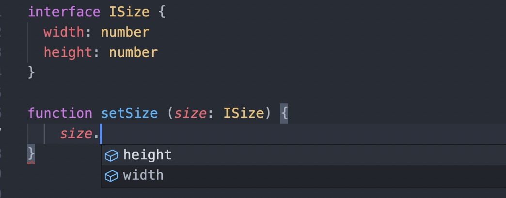
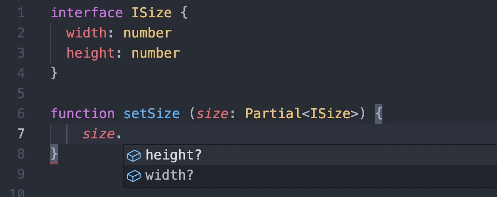
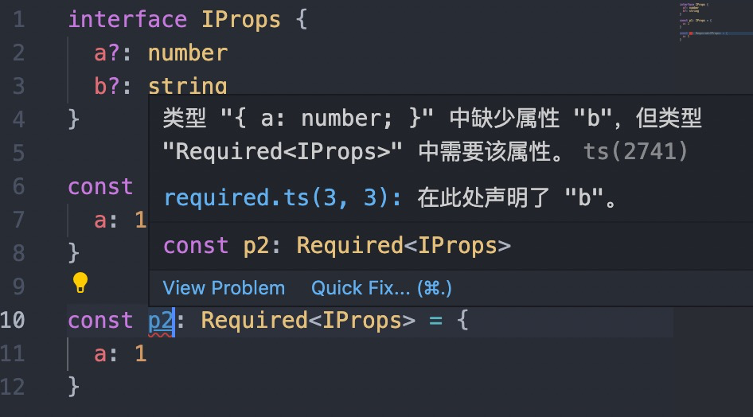
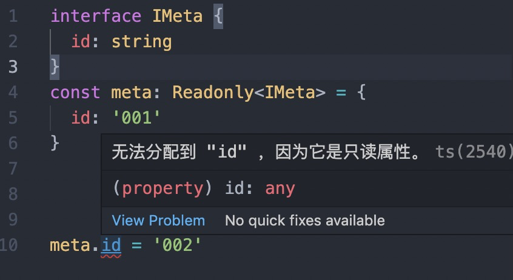
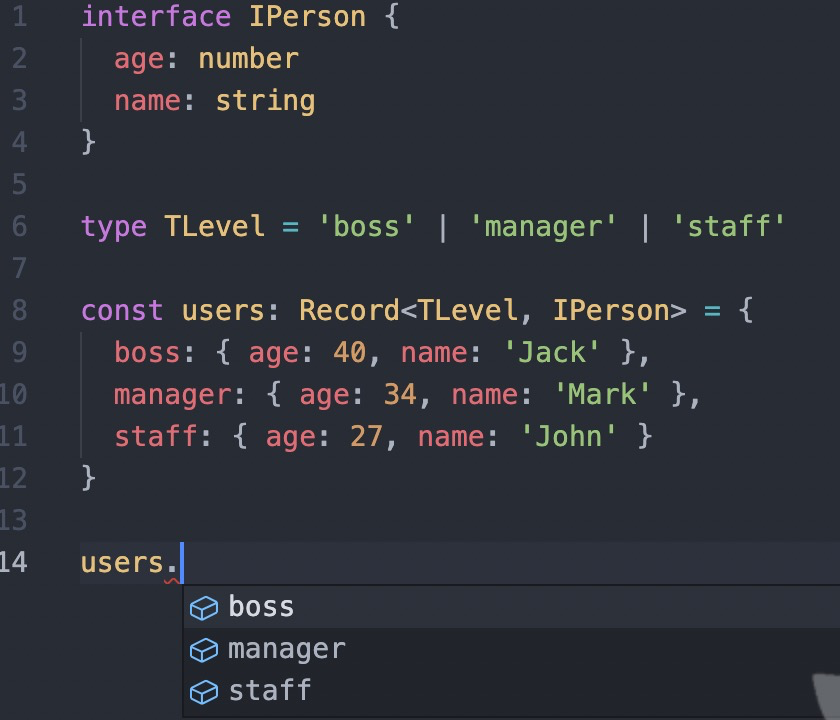
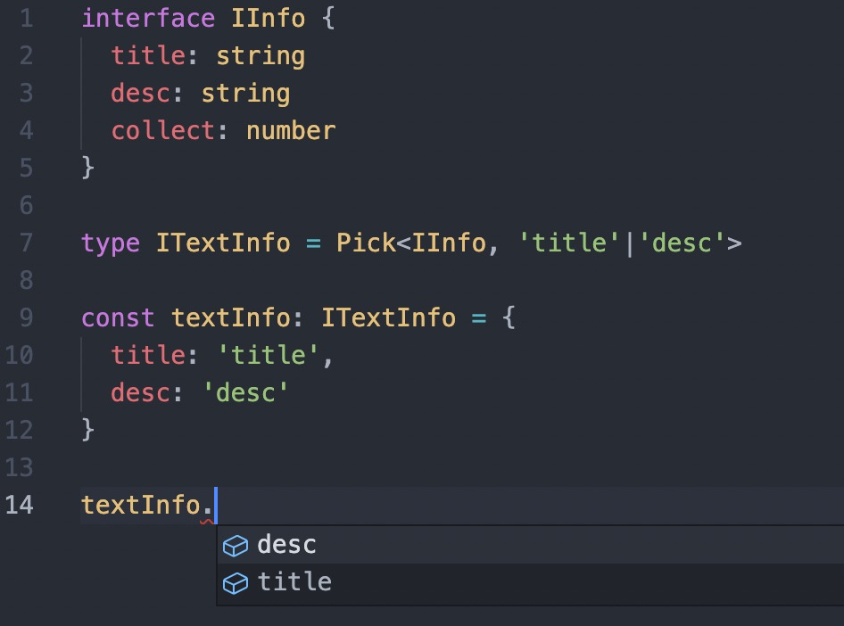
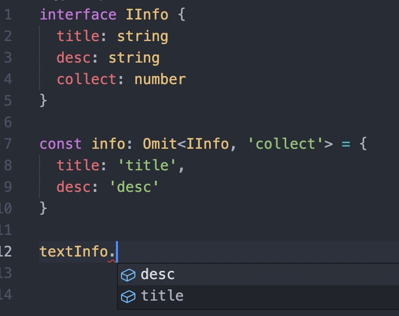

# TypeScript 知识

## 类型操作

### `keyof`

`keyof` 操作符可以提取一个对象类型的键值生成一个字符串或数值联合类型。

```ts
interface IPoint {
  x: number
  y: number
  z: number
}
type TP = keyof IPoint
// 等同 'x' | 'y' | 'z'
```

结合 `in` 操作符可用来遍历对象类型的键值

```ts
type TCopyPoint = {
  [key in keyof IPoint]: IPoint[key]
}
```

### `typeof` 

`typeof` 操作符可以用来引用变量或属性的类型

### 条件类型

`extends` 除了用与`interface` 的继承，也可用来做条件判断，格式：`T extends U ? Type1 : Type2`，如果类型`T`能赋值给类型`U`，则返回类型`Type1`，否则返回类型`Type2`。

```ts
interface Animate {
  run: () => void
}
interface Dog extends Animate {}

type A1 = Dog extends Animate ? number : string
// type A1 = number

type A2 = Error extends Animate ? number : string
// type A2 = string
```

`extends` 也能应用在联合类型上

```ts
type A3 = keyof Animate extends string | number ? string : number
```

## 实用类型

TypeScript提供了一些实用类型 用来帮助做类型转换，可在全局使用。

### `Partial<Type>`

构造一个新的类型，将`Type`中的所有属性都设置为可选的。




### `Required<Type>`

与`Partial` 相反，构造一个新类型，将`Type` 中的所有属性都设置为必须的。

```ts
interface IProps {
  a?: number
  b?: string
}

const p1: IProps = {
  a: 1
}

const p2: Required<IProps> = {
  a: 1
}
// 类型 "{ a: number; }" 中缺少属性 "b"，但类型 "Required<IProps>" 中需要该属性。
```


### `Readonly<Type>`

构造一个新类型，将`Type` 中的所有属性都设置为只读的。

```ts
interface IMeta {
  id: string
}
const meta: Readonly<IMeta> = {
  id: '001'
}

meta.id = '002'
// 无法分配到 "id" ，因为它是只读属性。
```


### `Record<Keys, Type>`

构造一个对象类型，对象的属性`key`值来自`Keys`，对象属性的`value`值是`Type`。可用于将一种类型的属性映射到另一种类型上。

```ts
interface IPerson {
  age: number
  name: string
}

type TLevel = 'boss' | 'manager' | 'staff'

const users: Record<TLevel, IPerson> = {
  boss: { age: 40, name: 'Jack' },
  manager: { age: 34, name: 'Mark' },
  staff: { age: 27, name: 'John' }
}

users.boss
```


### `Pick<Type, Keys>`

从`Type`类型上选取一组属性键值来构造新的类型

```ts
interface IInfo {
  title: string
  desc: string
  collect: number
}

type ITextInfo = Pick<IInfo, 'title'|'desc'>

const textInfo: ITextInfo = {
  title: 'title',
  desc: 'desc'
}

textInfo.desc
```


### `Omit<Type, Keys>`

构造一个新类型，先从`Type` 中选取所有属性，再移除在键值`Keys` 中的属性。

```ts
interface IInfo {
  title: string
  desc: string
  collect: number
}

const info: Omit<IInfo, 'collect'> = {
  title: 'title',
  desc: 'desc'
}

textInfo.desc
```


### `Exclude<Type, ExcludedUnion>`

通过从`Type` 中排除掉所有存在于`ExcludedUnion` 的联合类型成员来构造一个新类型

```ts
type T1 = Exclude<'a' | 'b' | 'c', 'c'>
// type T1 = 'a' | 'b'

type T2 = Exclude<number | string | (() => void), Function>
// type T2 = number | string
```

### `Extract<Type, Union>`

通过提取在`Type` 和 `Union` 都存在的联合类型成员来构造一个新的类型

```ts
type T3 = Extract<'a' | 'b' | 'c', 'c'>
// type T3 = 'c'

type T4 = Extract<number | string | (() => void), Function>
// type T4 = () => void
```

### `NonNullable<Type>`

构造一个新类型，排除掉`Type` 中的 `undefined` 和 `null`

```ts
type T5 = NonNullable<string | number | null | undefined>
// type T5 = string | number
```

### `Parameters<Type>`

根据函数类型`Type` 的参数中使用的类型构造一个元组类型。

```ts
type T6 = Parameters<() => void>
// type T6 = []

type T7 = Parameters<(text: string) => string>
// type T7 = [text: string]

declare function f1(arg: { a: number; b: string }): void;
type T8 = Parameters<typeof f1>
// type T8 = [arg: {a: number; b: string;}]
```

### `ConstructorParameters<Type>`

从构造函数类型的类型构造元组或数组类型。 它生成一个包含所有参数类型的元组类型（或者如果 Type 不是函数，则类型 never ）。

```ts
type T9 = ConstructorParameters<RegExpConstructor>
// type T9 = [pattern: string | RegExp, flags?: string]

type T10 = ConstructorParameters<FunctionConstructor>
// type T10 = string[]

class Person {
  constructor (name, age) {
  }
}
type T11 = ConstructorParameters<typeof Person>
// type T11 = [name: any, age: any]
```

### `ReturnType<Type>`

构造一个由函数类型`Type` 的返回类型组成的类型。

```ts
type T12 = ReturnType<() => string>
// type T12 = string

type T13 = ReturnType<() => {name: string, age: number}>
// type T13 = { name: string; age: number; }
```

### `InstanceType<Type>`

构建一个由构造函数实例类型`Type` 组成的类型。

```ts
class C {
  name: string
  age: number
  getName () {
    return this.name
  }
  getAge () {
    return this.age
  }
}
type T14 = InstanceType<typeof C>
// type T14 = C
```