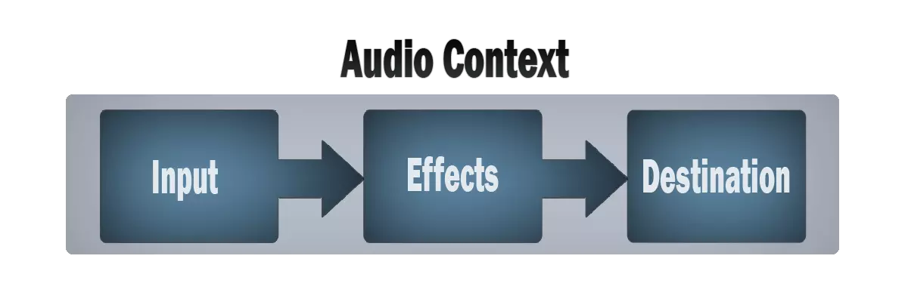
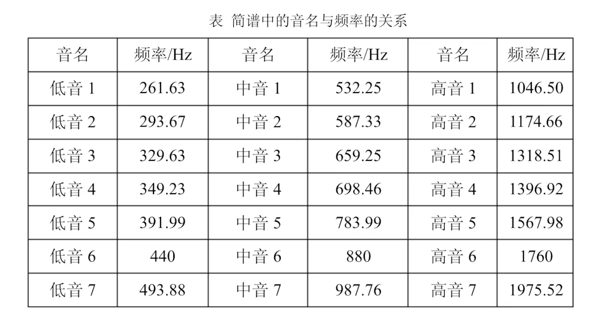
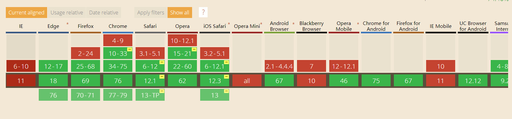

# `AudioContext` - Web API 接口

web页面中除了`audio`、`video`等标签外可以发出声音，还有音频上下文接口`AudioContext`。

> **AudioContext**接口表示由音频模块连接而成的音频处理图，每个模块对应一个[`AudioNode`](https://developer.mozilla.org/zh-CN/docs/Web/API/AudioNode)。**AudioContext**可以控制它所包含的节点的创建，以及音频处理、解码操作的执行。做任何事情之前都要先创建**AudioContext**对象，因为一切都发生在这个环境之中。

简单来说，`AudioContext` 可以用来控制管理网页上所有声音。在实际用途中，可以使用 `AudioContext` 的实例，创建一个音频源，或者很多音频源并且将他们连接到音频出口（一般是扬声器）。

## 如何实现出声



首先需要一个音频环境（AudioContext），接着需要有一个音频输入（input），再加上处理程序（effects），然后是音频输出（destination），最后把它们连接起来（connection），即可实现出声。

- 音频数据的输入可以是音频文件、从用户设备上输入的音频或视频、或自定义的数据等。

- 处理程序可以是分析器、处理器等，也可以没有，即直接将声源连接到扬声器。

- 音频的输出一般就是用户设备的扬声器。

## 如何使用`AudioContext`

### 创建一个 `AudioContext` 对象

```js
const audioCtx = new AudioContext()
```

### 创建一个音调控制对象

```js
const oscillator = audioCtx.createOscillator()
```

### 创建一个音量控制对象

```js
const gainNode = audioCtx.createGain()
```

### 将对象关联起来

```js
// 音调音量关联
oscillator.connect(gainNode)
// 音量和设备关联
gainNode.connect(audioCtx.destination)
```

### 设置音量和音调参数

```js
gainNode.gain.value = 0.5  // 音量 0~1
oscillator.type = 'sine'   // 音调类型指定为正弦波
oscillator.frequency.value = 400  // 音调频率400Hz，出声关键，不同频率的声音不同
```

### 播放和停止声音

```js
oscillator.start(audioCtx.currentTime)  // 播放
oscillator.stop() // 停止
oscillator.stop(audioCtx.currentTime + 2) // 播放两秒后停止
```

### 完整例子

```js
// 创建音频上下文
const audioCtx = new AudioContext()
// 创建音调控制对象
const oscillator = audioCtx.createOscillator()
// 创建音量控制对象
const gainNode = audioCtx.createGain()
// 音调音量关联
oscillator.connect(gainNode)
// 音量和设备关联
gainNode.connect(audioCtx.destination)
// 音调类型指定为正弦波。sin好听一些
oscillator.type = 'sine'
// 设置音调频率（作曲的关键）
oscillator.frequency.value = 400
// 先把当前音量设为0
gainNode.gain.setValueAtTime(0, audioCtx.currentTime)
// 0.01秒时间内音量从0到1线性变化，突然变化的话很生硬
gainNode.gain.linearRampToValueAtTime(1, audioCtx.currentTime + 0.01)
// 声音开始
oscillator.start(audioCtx.currentTime)
oscillator.stop(audioCtx.currentTime + 2)
```

## 部分属性与方法

### 属性

- [`AudioContext.currentTime`](https://developer.mozilla.org/zh-CN/docs/Web/API/AudioContext/currentTime)  - 以双精度浮点型数字返回硬件调用的秒数，AudioContext一创建就从0开始走，无法停掉、暂停或者重置。
- [`AudioContext.destination`](https://developer.mozilla.org/zh-CN/docs/Web/API/AudioContext/destination)  - 返回[`AudioDestinationNode`](https://developer.mozilla.org/zh-CN/docs/Web/API/AudioDestinationNode)对象，表示当前audio context中所有节点的最终节点，一般表示音频渲染设备。
- [`AudioContext.state`](https://developer.mozilla.org/zh-CN/docs/Web/API/AudioContext/state) - 返回`AudioContext`当前状态。

### 方法

- [`AudioContext.close()`](https://developer.mozilla.org/zh-CN/docs/Web/API/AudioContext/close) - 关闭一个音频环境, 释放任何正在使用系统资源的音频。
- [`AudioContext.createOscillator()`](https://developer.mozilla.org/zh-CN/docs/Web/API/AudioContext/createOscillator) - 创建一个[`OscillatorNode`](https://developer.mozilla.org/zh-CN/docs/Web/API/OscillatorNode), 它表示一个周期性波形，基本上来说创造了一个音调。
- [`AudioContext.createGain()`](https://developer.mozilla.org/zh-CN/docs/Web/API/AudioContext/createGain) - 创建一个[`GainNode`](https://developer.mozilla.org/zh-CN/docs/Web/API/GainNode),它可以控制音频的总音量。
- [`AudioContext.createAnalyser()`](https://developer.mozilla.org/zh-CN/docs/Web/API/AudioContext/createAnalyser) - 创建一个[`AnalyserNode`](https://developer.mozilla.org/zh-CN/docs/Web/API/AnalyserNode)，它可以用来显示音频时间和频率的数据。

## 拓展

### 乐谱频率

通过以上方式就可以发出声音了，但如何发出哆瑞咪发嗦啦西这些声音？首先需要知道哆瑞咪发嗦啦西这些声音对应的频率是多少，然后将 `oscillator.frequency.value` 的值改成对应声音的频率即可。



### 无法出声？

如果`AudioContext` 不生效，查看控制台，如果出现以下警告：

```
The AudioContext was not allowed to start. ...
```

解决方法：

1. 地址栏中输入 chrome://flags/#autoplay-policy

2. 将 `Autoplay policy` 由 `Disabled` 设为 `no user gesture is required`

### 兼容性



### 参考

- [AudioContext - Web API 接口参考](https://developer.mozilla.org/zh-CN/docs/Web/API/AudioContext)

- [让你的网页开口说话 —— audioContext API](https://xiaotianxia.github.io/blog/vuepress/js/useful_webapis_audiocontext.html?_=193678675665)

  

*ps: [demo地址](https://github.com/LiLiangKai/react-piano)*


